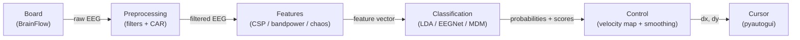
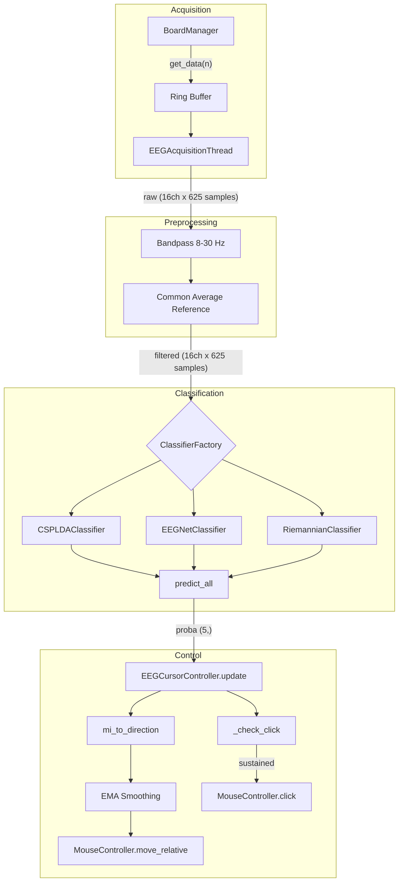
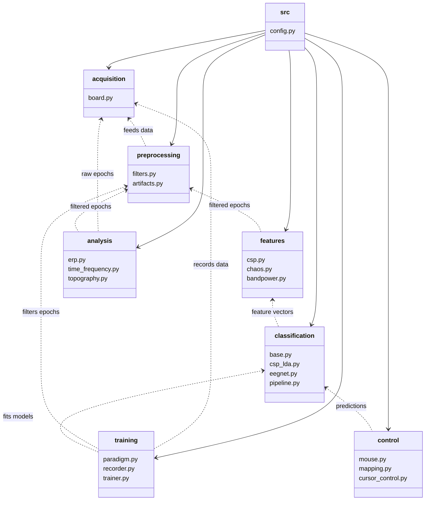

# System Architecture

> [!info] OpenBCI SimpleBuild
> A pure-EEG motor imagery brain-computer interface that translates 5-class imagined movement into 4-directional cursor control with click via sustained imagery. Built on OpenBCI Cyton+Daisy (16 channels) and BrainFlow.

## High-Level Data Flow

## Real-Time Pipeline Detail

## Module Hierarchy

## Key Design Decisions

| Decision | Rationale |
|----------|-----------|
| Pure EEG (no eye tracking) | Simpler, more accessible, demonstrates raw MI capability |
| 5 classes (rest + 4 directions) | Matches the 4-directional paradigm of BCI Competition IV 2a |
| CSP+LDA as default | Works well with small training sets (40 trials/class) |
| 2.5s classification window | 1.5-4.0s post-cue captures the strongest ERD/ERS |
| 16 Hz update rate | Balance between responsiveness and classification stability |
| Sustained imagery for click | No additional hardware needed; uses existing MI pipeline |

## Related Pages

- [[Acquisition]] -- Board connection and data streaming
- [[Preprocessing]] -- Filter chain details
- [[Features]] -- Feature extraction methods
- [[Classification]] -- Classifier implementations
- [[Control]] -- Cursor movement and click logic
- [[Training]] -- Calibration and model fitting
- [[Analysis]] -- ERP and ERDS analysis tools
- [[Configuration]] -- All tunable parameters
- [[Real-Time Control Loop]] -- Sequence diagram of the main loop
- [[Signal Processing Chain]] -- Detailed filter specifications
