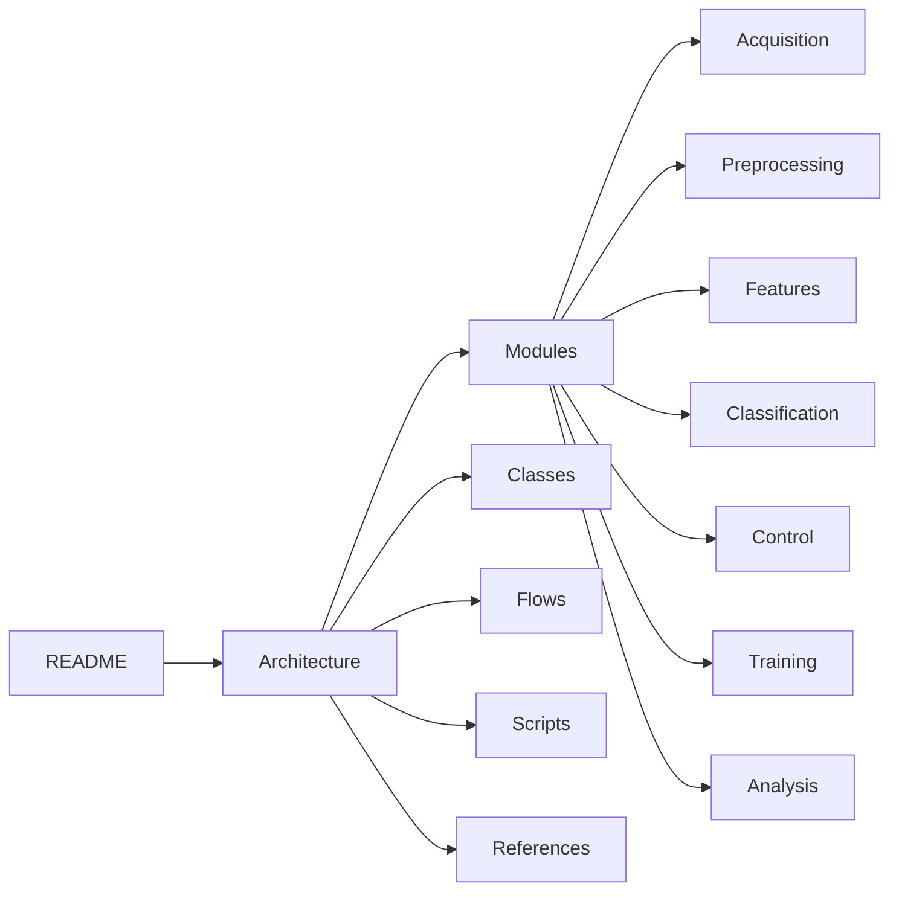

# OpenBCI SimpleBuild Knowledge Graph

> [!info] Welcome
> This Obsidian vault documents the complete architecture, code, and flows of the OpenBCI SimpleBuild motor imagery BCI system. Every page is interlinked. Open **Graph View** (Ctrl+G) to explore the knowledge graph visually.

---

## Architecture

- [[Architecture]] -- Full system architecture with module hierarchy

## Modules

| Module | Purpose |
|--------|---------|
| [[Acquisition]] | BrainFlow board management, data streaming |
| [[Preprocessing]] | Bandpass, notch, CAR, artifact handling |
| [[Features]] | CSP, chaos/entropy, band power extraction |
| [[Classification]] | CSP+LDA, EEGNet, Riemannian MDM |
| [[Control]] | Cursor movement, click detection, velocity mapping |
| [[Training]] | Graz paradigm, data recording, model training |
| [[Analysis]] | ERP accumulation, ERDS%, topographic maps |

## Class References

| Class | File | Module |
|-------|------|--------|
| [[BoardManager]] | `src/acquisition/board.py` | [[Acquisition]] |
| [[CSPLDAClassifier]] | `src/classification/csp_lda.py` | [[Classification]] |
| [[EEGNetClassifier]] | `src/classification/eegnet.py` | [[Classification]] |
| [[EEGCursorController]] | `src/control/cursor_control.py` | [[Control]] |
| [[ERPAccumulator]] | `src/analysis/erp.py` | [[Analysis]] |
| [[ERDSComputer]] | `src/analysis/time_frequency.py` | [[Analysis]] |
| [[ControlMapper]] | `src/control/mapping.py` | [[Control]] |

## Scripts

| Script | Purpose |
|--------|---------|
| [[run_eeg_cursor]] | Real-time cursor control application |
| [[erp_trainer]] | ERP training with live feedback |
| [[collect_training_data]] | Graz paradigm calibration session |
| [[train_model]] | Offline model training pipeline |

## Data Flows

| Flow | Description |
|------|-------------|
| [[Real-Time Control Loop]] | Acquire -> Preprocess -> Classify -> Move |
| [[Training Pipeline]] | Collect -> Extract -> Filter -> Reject -> Train -> Save |
| [[ERP Analysis Pipeline]] | Epoch -> Baseline -> Average -> ERDS% -> Display |
| [[Signal Processing Chain]] | Detailed filter chain with frequency info |

## References

| Reference | Content |
|-----------|---------|
| [[Configuration]] | All `settings.yaml` keys and which code reads them |
| [[Research Papers]] | All cited papers and their contributions |
| [[Channel Layout]] | 16-channel 10-20 positions and MI-relevant channels |
| [[Limitations]] | System boundaries and honest capability assessment |
