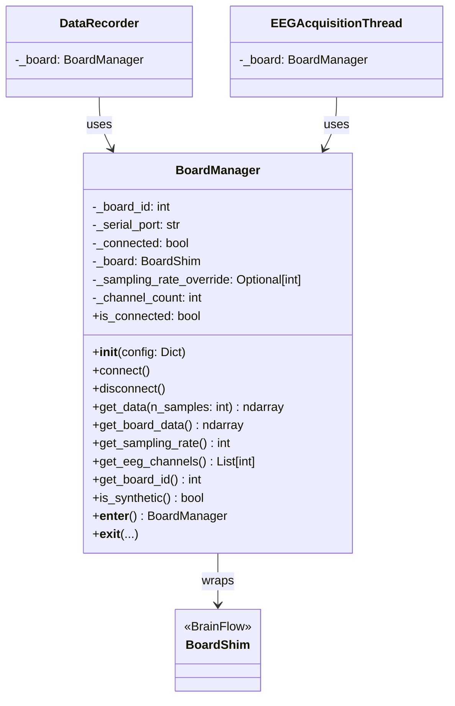

# BoardManager

> [!info] File Location
> `src/acquisition/board.py`

## Purpose

High-level wrapper around BrainFlow's `BoardShim` for EEG data acquisition. Manages connection lifecycle, provides automatic synthetic board fallback, and supports context-manager usage for safe cleanup.

## Class Diagram



## Constructor

```python
BoardManager(config: Dict) -> None
```

| Parameter | Type | Description |
|-----------|------|-------------|
| `config` | `Dict` | Full config dict; reads `board.board_id`, `board.serial_port`, `board.sampling_rate_override`, `board.channel_count` |

**Fallback logic**: If `board_id == -1` or `serial_port` is empty, automatically falls back to `SYNTHETIC_BOARD` for development.

## Key Methods

| Method | Signature | Description |
|--------|-----------|-------------|
| `connect()` | `-> None` | Prepares session, starts stream with 45000-sample ring buffer |
| `disconnect()` | `-> None` | Stops stream, releases session; safe to call when not connected |
| `get_data(n)` | `-> ndarray (ch, n)` | Non-destructive read of latest n samples from ring buffer |
| `get_board_data()` | `-> ndarray (ch, all)` | Destructive read: returns all data and clears buffer |
| `get_sampling_rate()` | `-> int` | Returns override if set, else queries BrainFlow |
| `get_eeg_channels()` | `-> List[int]` | EEG channel indices for the active board |
| `is_synthetic()` | `-> bool` | True if using synthetic board |

## Context Manager

```python
with BoardManager(config) as board:
    data = board.get_data(500)
# Automatically disconnects on exit
```

## Callers

| Caller | How Used |
|--------|----------|
| [[run_eeg_cursor]] | Creates board, connects, passes to EEGAcquisitionThread |
| [[collect_training_data]] | Creates board, connects, passes to DataRecorder |
| [[erp_trainer]] | Creates board for live collection or review mode |
| [[train_model]] | Creates temporary BoardManager to query sf and channels |
| `DataRecorder` | Reads data via `get_board_data()` during stop() |

## Related Pages

- [[Acquisition]] -- Module overview
- [[Configuration]] -- Board config keys
- [[Preprocessing]] -- Downstream consumer of raw data
