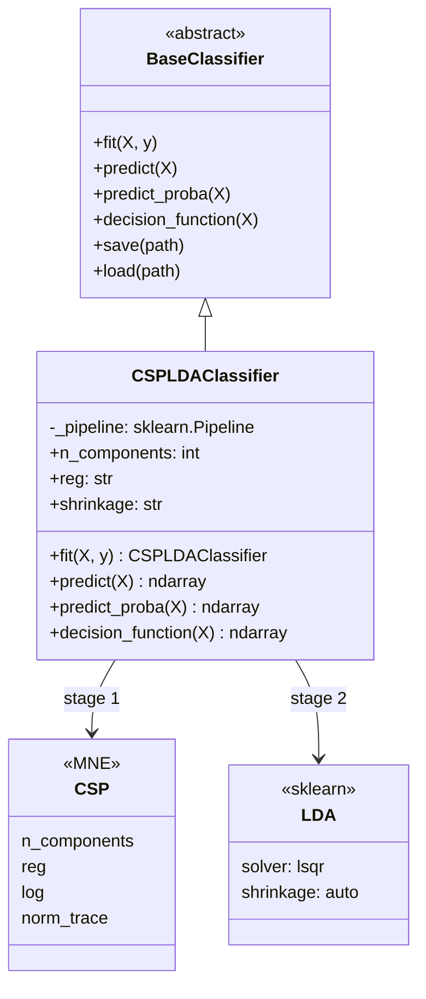

# CSPLDAClassifier

> [!info] File Location
> `src/classification/csp_lda.py`

## Purpose

The recommended starting classifier for motor imagery BCI. Combines Common Spatial Patterns (CSP) for spatial filtering with shrinkage Linear Discriminant Analysis (LDA) for classification. The `decision_function` returns continuous signed distances suitable for proportional cursor velocity.

## Class Diagram



## Constructor

```python
CSPLDAClassifier(
    n_components: int = 12,
    reg: str = "ledoit_wolf",
    shrinkage: str = "auto",
)
```

| Parameter | Default | Description |
|-----------|---------|-------------|
| `n_components` | 12 | CSP components (6 pairs for 16 channels) |
| `reg` | `"ledoit_wolf"` | CSP covariance regularization |
| `shrinkage` | `"auto"` | LDA Ledoit-Wolf shrinkage intensity |

## Internal Pipeline

```python
Pipeline([
    ("csp", CSP(n_components=12, reg="ledoit_wolf", log=True, norm_trace=True)),
    ("lda", LDA(solver="lsqr", shrinkage="auto")),
])
```

## Key Methods

| Method | Input Shape | Output Shape | Notes |
|--------|------------|--------------|-------|
| `fit(X, y)` | `(n_trials, 16, 625)` | self | Learns CSP filters + LDA boundary |
| `predict(X)` | `(n_trials, 16, 625)` or `(16, 625)` | `(n_trials,)` | Integer labels |
| `predict_proba(X)` | same | `(n_trials, n_classes)` | Class probabilities |
| `decision_function(X)` | same | `(n_trials,)` binary or `(n_trials, n_classes)` multi | Continuous scores for cursor velocity |

## Guard Rails

- Auto-reduces `n_components` if fewer trials than components
- Warns if any class has fewer than 5 trials
- Requires at least 2 classes for CSP
- Handles 2D single-trial input by expanding to 3D

## References

> Ramoser et al. (2000). "Optimal Spatial Filtering of Single Trial EEG During Imagined Hand Movement." IEEE Trans. Rehab. Eng.
> Blankertz et al. (2008). "Optimizing Spatial Filters for Robust EEG Single-Trial Analysis." IEEE Signal Processing Magazine.

## Related Pages

- [[Classification]] -- Module overview
- [[Features]] -- CSP is a feature extraction + classification hybrid
- [[EEGNetClassifier]] -- Alternative deep learning classifier
- [[ControlMapper]] -- Consumes `decision_function` output
- [[train_model]] -- Script that fits this classifier
- [[Research Papers]] -- Full paper references
