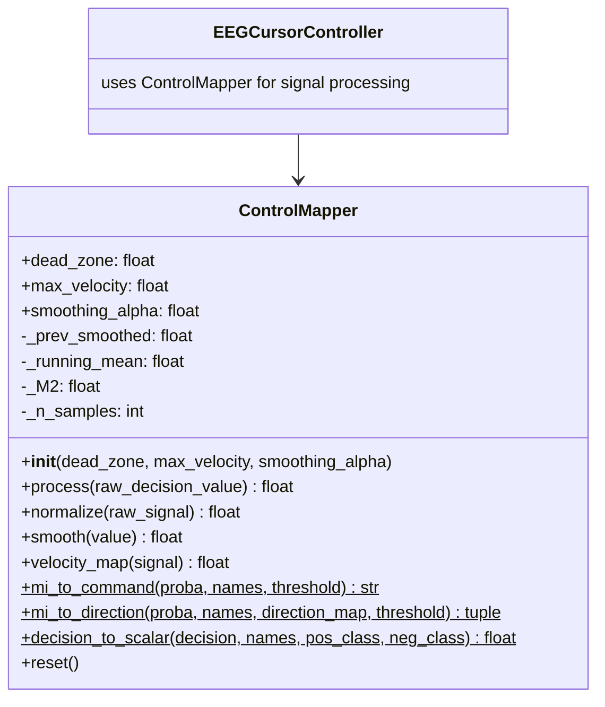
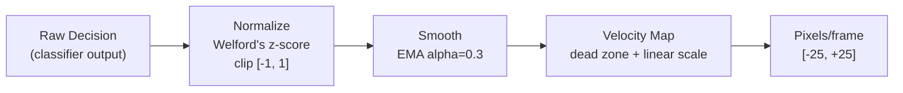

# ControlMapper

> [!info] File Location
> `src/control/mapping.py`

## Purpose

Converts raw classifier decision values into pixel-per-frame cursor velocities through a three-stage pipeline (normalize, smooth, velocity map). Also provides static methods for discrete command mapping from multi-class probabilities.

## Class Diagram



## Three-Stage Pipeline



## Constructor

```python
ControlMapper(
    dead_zone: float = 0.15,
    max_velocity: float = 30.0,
    smoothing_alpha: float = 0.3,
)
```

## Methods

### Instance Methods (Stateful)

| Method | Input | Output | Description |
|--------|-------|--------|-------------|
| `process(raw)` | `float` (decision score) | `float` (px/frame) | Full pipeline: normalize -> smooth -> velocity_map |
| `normalize(raw)` | `float` | `float [-1, 1]` | Welford's running z-score, clipped |
| `smooth(value)` | `float` | `float` | EMA: `(1-alpha)*prev + alpha*value` |
| `velocity_map(signal)` | `float [-1, 1]` | `float [-max_vel, +max_vel]` | Dead zone + linear scaling |
| `reset()` | -- | -- | Clears all running statistics |

### Static Methods (Stateless)

| Method | Input | Output | Description |
|--------|-------|--------|-------------|
| `mi_to_command(proba, names, thresh)` | probabilities | class name or "rest" | Discrete command from highest probability |
| `mi_to_direction(proba, names, map, thresh)` | probabilities | `(direction, confidence)` | Direction + confidence for movement |
| `decision_to_scalar(decision, names, pos, neg)` | decision scores | `float` | Multi-class scores -> scalar for velocity |

## Welford's Online Algorithm

The `normalize()` method uses Welford's algorithm for numerically stable online mean/variance computation:

```python
# Update running statistics with each new sample
n += 1
old_mean = running_mean
running_mean += (x - old_mean) / n
M2 += (x - old_mean) * (x - running_mean)
variance = M2 / (n - 1)
```

This adapts to the classifier's output distribution without requiring a pre-calibration phase.

## Guard Rails

- NaN/Inf input returns 0.0 without corrupting statistics
- Extremely large values (>1e6) are clipped before Welford update
- First sample returns 0.0 (variance undefined with n=1)

## Related Pages

- [[Control]] -- Module overview
- [[EEGCursorController]] -- Uses ControlMapper for signal processing
- [[Classification]] -- Provides raw decision scores
- [[Real-Time Control Loop]] -- Shows ControlMapper in context
- [[Configuration]] -- `control.dead_zone`, `control.max_velocity`, `control.smoothing_alpha`
