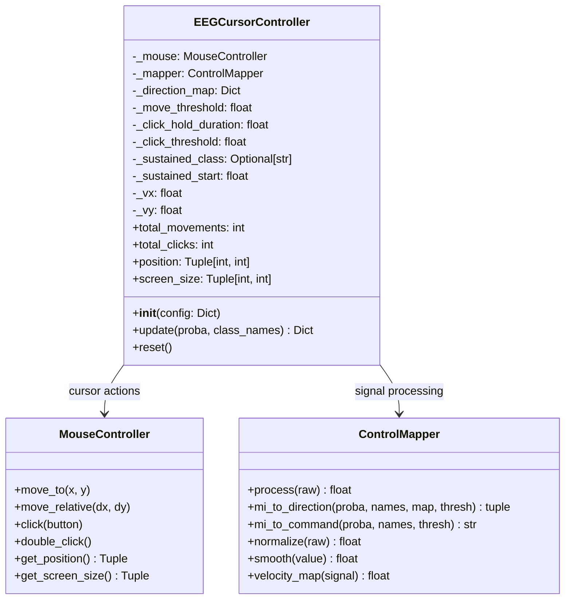
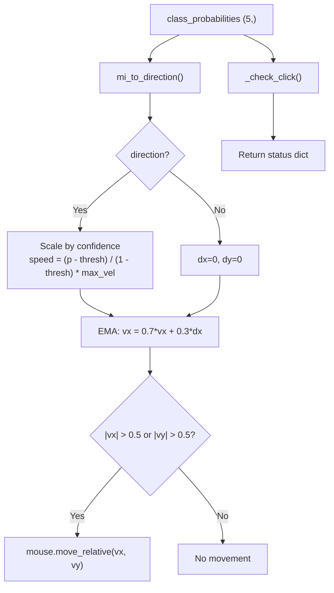

# EEGCursorController

> [!info] File Location
> `src/control/cursor_control.py`

## Purpose

State machine that combines 5-class motor imagery classification output with velocity mapping, EMA smoothing, and sustained-imagery click detection into a single `update()` call per control loop iteration (~16 Hz).

## Class Diagram



## Constructor

```python
EEGCursorController(config: Dict) -> None
```

Reads from `config["control"]` and `config["control"]["click"]`.

## update() Method

```python
def update(self, class_probabilities: ndarray, class_names: List[str]) -> Dict
```

Called once per control loop iteration. Returns:

```python
{
    "direction": "left" | "right" | "up" | "down" | None,
    "confidence": 0.0-1.0,
    "velocity": (dx, dy),
    "click_event": "click" | "double_click" | None,
    "predicted_class": "left_hand" | "right_hand" | ... ,
}
```

## Update Flow



## Statistics

| Property | Type | Description |
|----------|------|-------------|
| `total_movements` | `int` | Count of frames where cursor actually moved |
| `total_clicks` | `int` | Total clicks fired (single + double) |
| `position` | `(int, int)` | Current cursor pixel position |
| `screen_size` | `(int, int)` | Screen resolution |

## Related Pages

- [[Control]] -- Module overview with click state machine diagram
- [[ControlMapper]] -- Signal processing component
- [[Classification]] -- Provides input probabilities
- [[run_eeg_cursor]] -- Script that creates and drives this controller
- [[Real-Time Control Loop]] -- Sequence diagram
- [[Configuration]] -- Control config keys
