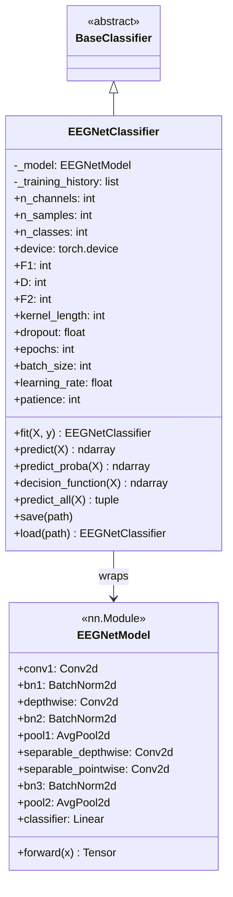
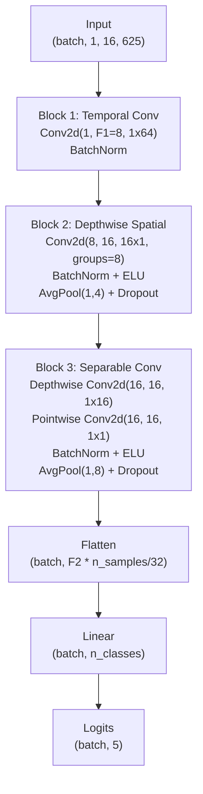

# EEGNetClassifier

> [!info] File Location
> `src/classification/eegnet.py`

## Purpose

Compact convolutional neural network designed for EEG-based BCIs. Learns spatial and temporal features end-to-end from raw (bandpass-filtered) epochs using depthwise and separable convolutions. Implements the architecture from Lawhern et al. (2018).

## Class Diagram



## EEGNet Architecture (3 Blocks)



## Constructor

```python
EEGNetClassifier(
    n_channels=16, n_samples=625, n_classes=5, device="auto",
    F1=8, D=2, F2=16, kernel_length=64, dropout=0.5,
    epochs=300, batch_size=32, learning_rate=1e-3,
    weight_decay=1e-3, patience=50, validation_fraction=0.1,
)
```

## Training

- Optimizer: Adam with weight decay
- Loss: CrossEntropyLoss
- Early stopping: patience=50 epochs, restores best weights
- Max-norm constraint on depthwise conv weights (max_norm=1, per Lawhern 2018)
- 10% validation split for early stopping

## Save/Load

Uses PyTorch `state_dict` checkpoint (not joblib):

```python
# Saves architecture params + weights + training history
clf.save("models/eegnet.pt")

# Reconstructs model from checkpoint
clf = EEGNetClassifier.load("models/eegnet.pt", device="auto")
```

> [!warning] Data Requirements
> EEGNet has ~4,000 parameters and typically needs 100+ trials/class (500+ total) for reliable training. With the default 40 trials/class, it often underfits. CSP+LDA is recommended for small datasets. See [[Limitations]].

## References

> Lawhern, V. J., et al. (2018). "EEGNet: a compact convolutional neural network for EEG-based brain-computer interfaces." Journal of Neural Engineering, 15(5), 056013.

## Related Pages

- [[Classification]] -- Module overview
- [[CSPLDAClassifier]] -- Recommended alternative for small datasets
- [[Configuration]] -- EEGNet config keys under `classification.eegnet`
- [[train_model]] -- Script that trains EEGNet
- [[Research Papers]] -- Lawhern et al. (2018)
