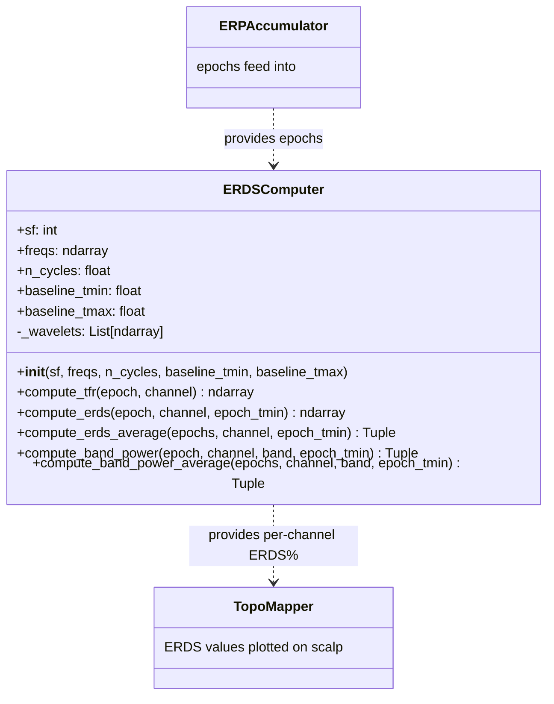

# ERDSComputer

> [!info] File Location
> `src/analysis/time_frequency.py`

## Purpose

Computes Event-Related Desynchronization/Synchronization (ERDS%) maps using complex Morlet wavelets. Shows how oscillatory power changes over time and frequency during motor imagery, revealing the mu (8-12 Hz) ERD that is the primary signal for MI-BCIs.

## Class Diagram



## Constructor

```python
ERDSComputer(
    sf: int = 125,
    freqs: Optional[ndarray] = None,  # default: 1-40 Hz in 1 Hz steps
    n_cycles: float = 5.0,
    baseline_tmin: float = 0.0,       # seconds relative to epoch start
    baseline_tmax: float = 1.0,
)
```

## ERDS% Formula

```
ERDS% = ((power(t,f) - baseline_power(f)) / baseline_power(f)) * 100
```

| Value | Meaning | Motor Imagery Interpretation |
|-------|---------|------------------------------|
| Negative | ERD (desynchronization) | Mu power decrease during imagery |
| Positive | ERS (synchronization) | Beta rebound after imagery |
| Zero | No change | Same power as baseline |

## Key Methods

| Method | Input | Output | Description |
|--------|-------|--------|-------------|
| `compute_tfr` | single epoch | `(40, n_samples)` | Raw power via Morlet convolution |
| `compute_erds` | single epoch | `(40, n_samples)` | Baseline-normalized ERDS% |
| `compute_erds_average` | stacked epochs | `(mean, std)` | Multi-trial average (more stable) |
| `compute_band_power` | single epoch + band | `(power, erds)` timecourses | Band-specific power over time |
| `compute_band_power_average` | stacked epochs + band | `(mean_power, mean_erds, std_erds)` | Multi-trial band timecourse |

## Morlet Wavelet Parameters

- `n_cycles = 5.0` -- Trade-off between time and frequency resolution
- At 10 Hz: wavelet width = 5/(2*pi*10) = ~0.08s (good time resolution)
- At 30 Hz: wavelet width = 5/(2*pi*30) = ~0.027s (excellent time resolution)
- Wavelets are normalized to unit energy

## References

> Pfurtscheller, G. & Lopes da Silva, F. H. (1999). "Event-related EEG/MEG synchronization and desynchronization: basic principles." Clinical Neurophysiology, 110(11), 1842-1857.

> Graimann, B. & Pfurtscheller, G. (2006). "Quantification and visualization of event-related changes in oscillatory brain activity in the time-frequency domain." Progress in Brain Research.

## Related Pages

- [[Analysis]] -- Module overview
- [[ERPAccumulator]] -- Provides epochs for ERDS analysis
- [[erp_trainer]] -- Script that displays ERDS% maps in real time
- [[ERP Analysis Pipeline]] -- Full flow diagram
- [[Signal Processing Chain]] -- Frequency band definitions
- [[Research Papers]] -- Pfurtscheller (1999), Graimann (2006)
