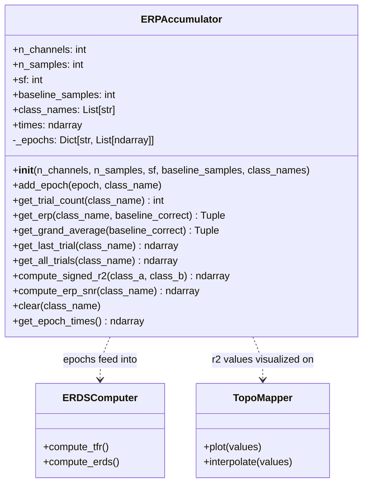

# ERPAccumulator

> [!info] File Location
> `src/analysis/erp.py`

## Purpose

Maintains per-class epoch buffers and computes running ERP (Event-Related Potential) averages with baseline correction, standard deviation bands, signed-r2 discriminability maps, and signal-to-noise ratio estimates. Used for real-time neurofeedback during MI training.

## Class Diagram



## Constructor

```python
ERPAccumulator(
    n_channels: int,
    n_samples: int,
    sf: int = 125,
    baseline_samples: int = 125,
    class_names: Optional[List[str]] = None,
)
```

## Key Methods

| Method | Signature | Output | Description |
|--------|-----------|--------|-------------|
| `add_epoch` | `(epoch, class_name)` | None | Add one epoch to the class buffer |
| `get_erp` | `(class_name, baseline_correct=True)` | `(mean, std)` each `(n_ch, n_samples)` | Baseline-corrected class average |
| `get_grand_average` | `(baseline_correct=True)` | `(mean, std)` | Average across all classes |
| `compute_signed_r2` | `(class_a, class_b)` | `(n_ch, n_samples)` | Discriminability map [-1, 1] |
| `compute_erp_snr` | `(class_name)` | `(n_ch,)` | Signal-to-noise ratio per channel |
| `get_last_trial` | `(class_name)` | `(n_ch, n_samples)` | Most recent single trial |
| `get_all_trials` | `(class_name)` | `(n_trials, n_ch, n_samples)` | All accumulated trials stacked |

## Signed-r2 Discriminability

```
signed_r2 = sign(mean_A - mean_B) * r2
```

Shows WHERE (channels) and WHEN (timepoints) two MI classes produce different brain signals:
- Positive: class A has higher amplitude
- Negative: class B has higher amplitude
- Near zero: no difference (not discriminative)

## ERP SNR

```
SNR = mean(|post-stimulus amplitude|) / mean(baseline std)
```

Higher SNR means the subject's motor imagery signal is more consistent and detectable. Useful for real-time feedback: "Your signal on C3 is strong."

## Related Pages

- [[Analysis]] -- Module overview
- [[ERDSComputer]] -- Time-frequency analysis companion
- [[erp_trainer]] -- Script that uses ERPAccumulator for live feedback
- [[ERP Analysis Pipeline]] -- Full flow diagram
- [[Research Papers]] -- Luck (2014), Blankertz et al. (2011)
