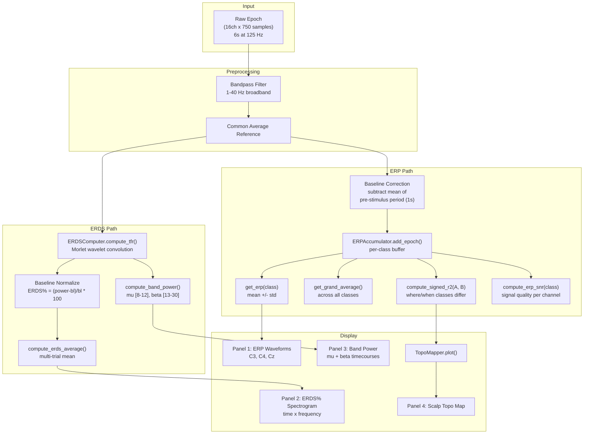
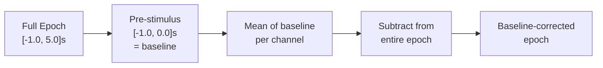

# ERP Analysis Pipeline

> [!info] Overview
> The analysis flow used by [[erp_trainer]] for real-time neurofeedback during motor imagery training. Shows how raw epochs are transformed into ERP averages, ERDS% spectrograms, band power timecourses, and scalp topographic maps.

## Full Pipeline



## Baseline Correction



**Purpose**: Removes slow drifts and DC offset so that post-stimulus changes are visible relative to the pre-stimulus state.

## ERDS% Interpretation

| ERDS% Value | Color (RdBu_r) | Meaning | MI Significance |
|-------------|-----------------|---------|-----------------|
| -50% to -100% | Blue | Strong ERD | Mu desynchronization during imagery |
| -10% to -50% | Light blue | Mild ERD | Weak but present imagery signal |
| -10% to +10% | White | No change | Baseline level |
| +10% to +50% | Light red | Mild ERS | Post-imagery beta rebound |
| +50% to +100% | Red | Strong ERS | Strong beta rebound |

## Signed-r2 Discriminability

The signed-r2 map shows where and when two MI classes produce different brain signals:

```
signed_r2 = sign(mean_A - mean_B) * (SS_between / SS_total)
```

- **High r2 at C3** for left vs right hand: C3 (left hemisphere) shows different activation -- good sign
- **Low r2 everywhere**: Classes are not distinguishable -- subject needs more practice or different strategy

## Related Pages

- [[erp_trainer]] -- Script that implements this pipeline
- [[Analysis]] -- Module overview
- [[ERPAccumulator]] -- Running ERP computation
- [[ERDSComputer]] -- Time-frequency decomposition
- [[Channel Layout]] -- 10-20 positions for topographic maps
- [[Research Papers]] -- Pfurtscheller (1999), Luck (2014)
