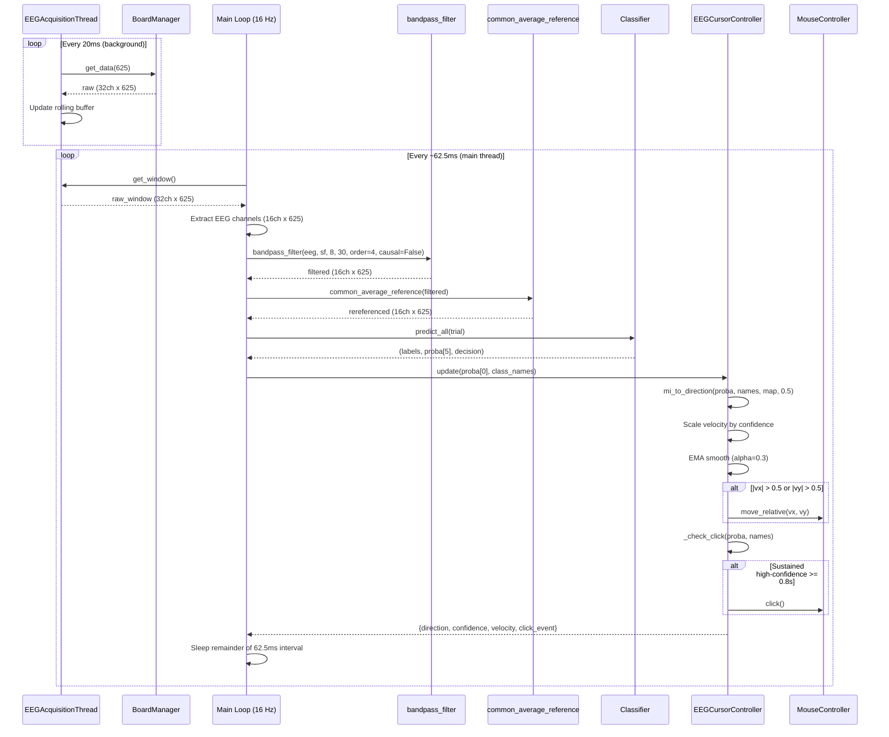

# Real-Time Control Loop

> [!info] Overview
> The core loop running at 16 Hz in [[run_eeg_cursor]]. Each iteration acquires the latest EEG window, preprocesses it identically to training, classifies, and updates the cursor position. Total latency per iteration: 10-50ms.

## Sequence Diagram

## Timing Budget

| Stage | Typical Duration | Notes |
|-------|-----------------|-------|
| `get_window()` | < 1ms | Lock + array copy |
| Channel extraction | < 1ms | Numpy indexing |
| Bandpass filter | 2-5ms | 4th-order Butterworth, `sosfiltfilt` on 625 samples |
| CAR | < 1ms | Mean subtraction |
| Classification (CSP+LDA) | 1-3ms | CSP transform + LDA predict |
| Classification (EEGNet) | 5-20ms | PyTorch forward pass (CPU/GPU) |
| Cursor update | < 1ms | Velocity calc + pyautogui move |
| **Total per iteration** | **10-30ms** | Well within 62.5ms budget |

## Data Shape Through Pipeline

```mermaid
flowchart LR
    A["Board Ring Buffer\n(32 x 45000)"] -->|get_data| B["Raw Window\n(32 x 625)"]
    B -->|channel select| C["EEG Window\n(16 x 625)"]
    C -->|bandpass| D["Filtered\n(16 x 625)"]
    D -->|CAR| E["Clean\n(16 x 625)"]
    E -->|expand dim| F["Trial\n(1 x 16 x 625)"]
    F -->|predict_all| G["Proba (1 x 5)\nDecision (1 x 5)"]
    G -->|squeeze| H["Proba (5,)"]
    H -->|update| I["dx, dy pixels"]
```

## Graceful Shutdown

- `SIGINT` / `SIGTERM` sets `shutdown_event`
- Main loop checks `shutdown_event.is_set()` each iteration
- `shutdown_event.wait(timeout=sleep_time)` replaces `time.sleep()` for responsive exit
- Finally block: stop acquisition thread -> disconnect board -> print stats

## Related Pages

- [[run_eeg_cursor]] -- Script implementing this loop
- [[Architecture]] -- System-level view
- [[Preprocessing]] -- Filter details
- [[Classification]] -- Classifier types
- [[Control]] -- Cursor control state machine
- [[EEGCursorController]] -- Update method details
- [[Limitations]] -- 2.5s window lag, 16 Hz update rate constraints
