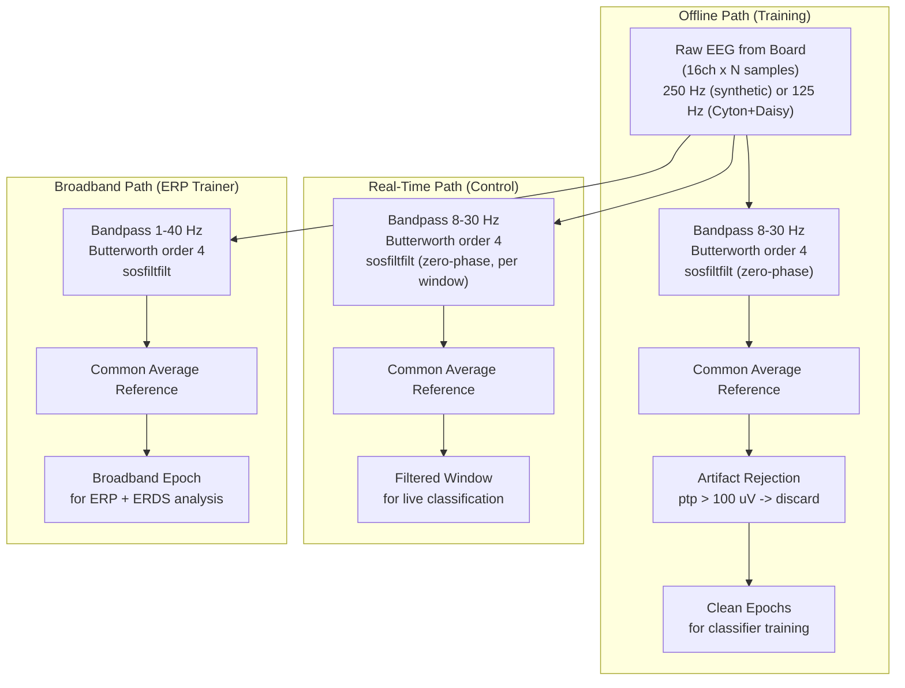

# Signal Processing Chain

> [!info] Overview
> Detailed specification of the filter chain applied to EEG data, including frequency response characteristics, filter order effects, and the difference between offline (training) and real-time (control) processing paths.

## Two Processing Paths



## Bandpass Filter Specifications

### MI-Specific (8-30 Hz)

| Parameter | Value | Rationale |
|-----------|-------|-----------|
| Type | Butterworth | Maximally flat passband |
| Order | 4 (effective 8 after sosfiltfilt) | Good rolloff without ringing |
| Low cutoff | 8 Hz | Captures mu rhythm (8-12 Hz) |
| High cutoff | 30 Hz | Captures beta rhythm (13-30 Hz) |
| Implementation | SOS (second-order sections) | Numerical stability |
| Offline mode | `sosfiltfilt` | Zero-phase, no time delay |
| Real-time mode | `sosfilt` (causal fallback) | Minimal latency |

### Frequency Response

```mermaid
xychart-beta
    title "Bandpass Filter Response (8-30 Hz, order 4)"
    x-axis "Frequency (Hz)" [0, 5, 8, 10, 12, 15, 20, 25, 30, 35, 40, 50]
    y-axis "Gain (dB)" [-40, -30, -20, -10, -6, -3, 0, 0, -3, -6, -20, -40]
    line ["-40", "-20", "-3", "0", "0", "0", "0", "0", "-3", "-10", "-20", "-40"]
```

### -3dB Points

| Band | -3dB Low | -3dB High | Passband | Transition Width |
|------|---------|-----------|----------|-----------------|
| MI (8-30) | ~7.4 Hz | ~31.5 Hz | 8-30 Hz | ~2 Hz each side |
| Broadband (1-40) | ~0.9 Hz | ~42 Hz | 1-40 Hz | ~2 Hz each side |

## Notch Filter

| Parameter | Value |
|-----------|-------|
| Type | IIR notch (iirnotch) |
| Center frequency | 60 Hz (US) or 50 Hz (EU) |
| Quality factor | 30 |
| Bandwidth (-3dB) | 60/30 = 2 Hz (59-61 Hz) |

> [!note] Notch Usage
> The notch filter is available in the codebase but is NOT applied in either the training or real-time pipeline. The MI bandpass (8-30 Hz) already excludes line noise at 50/60 Hz. It would be needed for the broadband (1-40 Hz) path if line noise is present.

## Common Average Reference

```
CAR(channel_i) = channel_i - mean(all channels)
```

- Removes global noise shared across all electrodes
- Assumes uniform noise contribution from all 16 channels
- Vulnerability: a single bad channel corrupts ALL channels after CAR

## Minimum Sample Requirements

| Filter | Minimum Samples | Formula | At 250 Hz |
|--------|----------------|---------|-----------|
| Bandpass (zero-phase) | 25 | `6 * order + 1` | 0.1s |
| Notch (zero-phase) | 7 | Fixed for 2nd-order | 0.03s |
| Causal fallback | 1 | No minimum | Instant |

## Edge Effects

For `sosfiltfilt` (zero-phase), transient artifacts appear at both edges of the data:

- Transient length: ~`3 * (filter_order / sampling_rate)` = ~48ms at 250 Hz for order 4
- The classification window [1.5, 4.0]s avoids cue onset transients
- Edge effects at window boundaries are tolerable for 2.5s windows

## CausalFilterState (Real-Time Streaming)

For chunk-by-chunk filtering without boundary artifacts:

```python
filt = CausalFilterState(sf=250, low=8.0, high=30.0, order=4)
while streaming:
    chunk = board.get_data(50)  # 50 new samples
    filtered = filt.apply(chunk)  # Maintains state across calls
```

> [!note] Not Currently Used
> The real-time control loop in [[run_eeg_cursor]] re-filters the entire 2.5s window each iteration using `sosfiltfilt`, rather than using `CausalFilterState`. This is computationally more expensive but ensures consistent zero-phase filtering that matches the training pipeline.

## Related Pages

- [[Preprocessing]] -- Module overview
- [[Acquisition]] -- Data source
- [[Features]] -- Consumes filtered data
- [[Real-Time Control Loop]] -- Uses MI bandpass in the main loop
- [[Training Pipeline]] -- Uses MI bandpass during prepare_data()
- [[Configuration]] -- Filter parameter config keys
- [[Limitations]] -- Edge effects, CAR assumptions, fixed frequency band
