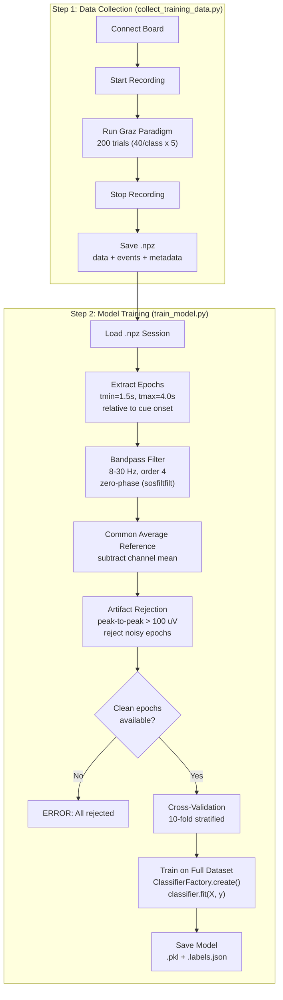
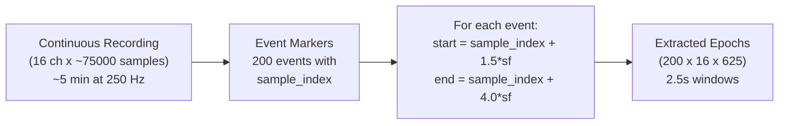

# Training Pipeline

> [!info] Overview
> The complete offline training workflow from raw EEG recording to a saved, cross-validated classifier. Orchestrated by [[collect_training_data]] -> [[train_model]], with [[ModelTrainer]] handling the preprocessing and fitting.

## End-to-End Flow

## Epoch Extraction Detail

## Artifact Rejection Statistics

Typical session with good electrode contact:

| Metric | Value |
|--------|-------|
| Total epochs extracted | 200 |
| Rejected (ptp > 100 uV) | 10-30 (5-15%) |
| Clean epochs for training | 170-190 |
| Threshold | 100 uV (configurable) |

> [!warning] All-Rejection Scenario
> If ALL epochs are rejected, the script exits with an error. This indicates either: bad electrode impedances, threshold too low, or excessive artifacts. Increase `preprocessing.artifact_threshold_uv` or fix electrode contact.

## Cross-Validation

- **Method**: Stratified K-fold (preserves class ratios in each fold)
- **Default K**: 10 (reduced if smallest class has fewer samples)
- **Estimator**: The full sklearn Pipeline (CSP + LDA) is re-fitted on each fold's training set, ensuring no data leakage from CSP spatial filters
- **Metrics reported**: Mean accuracy, std accuracy, chance level (1/n_classes)

## Related Pages

- [[collect_training_data]] -- Step 1: record calibration data
- [[train_model]] -- Step 2: train and save model
- [[Training]] -- Module overview
- [[Preprocessing]] -- Filters applied during prepare_data()
- [[Classification]] -- ClassifierFactory creates the classifier
- [[run_eeg_cursor]] -- Step 3: use the model for cursor control
- [[Configuration]] -- Training, preprocessing, and classification keys
