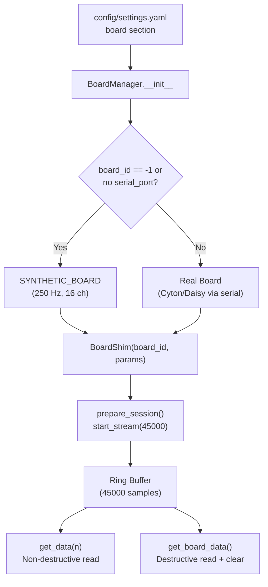

# Acquisition Module

> [!info] Purpose
> Wraps BrainFlow's `BoardShim` into a high-level [[BoardManager]] class that handles connection lifecycle, automatic synthetic board fallback, and context-manager support for safe cleanup.

## File: `src/acquisition/board.py`

## Architecture

## Board Types

| Board | `board_id` | Sampling Rate | Channels | Use Case |
|-------|-----------|---------------|----------|----------|
| Synthetic | -1 | 250 Hz | 16 EEG | Development, testing |
| Cyton | 0 | 250 Hz | 8 EEG | Single board |
| Cyton+Daisy | 2 | 125 Hz | 16 EEG | Full montage (production) |

## Data Flow

- `get_data(n_samples)` -- Reads from the ring buffer **without clearing**. Used in the real-time loop via [[EEGCursorController]] to always get the latest window.
- `get_board_data()` -- Reads **and clears** the ring buffer. Used by [[DataRecorder]] during calibration to capture all accumulated samples.

## Key Class

- [[BoardManager]] -- Full class reference

## Downstream Consumers

- [[Preprocessing]] -- Receives raw `(16, n_samples)` arrays
- [[Training]] -- [[DataRecorder]] wraps BoardManager for calibration sessions
- [[run_eeg_cursor]] -- Creates BoardManager, passes to EEGAcquisitionThread
- [[collect_training_data]] -- Creates BoardManager, passes to DataRecorder

## Configuration Keys

| Key | Default | Read By |
|-----|---------|---------|
| `board.board_id` | -1 (synthetic) | `BoardManager.__init__` |
| `board.serial_port` | `""` | `BoardManager.__init__` |
| `board.sampling_rate_override` | null | `BoardManager.get_sampling_rate` |
| `board.channel_count` | 16 | `BoardManager.__init__` |

See [[Configuration]] for the complete key reference.
