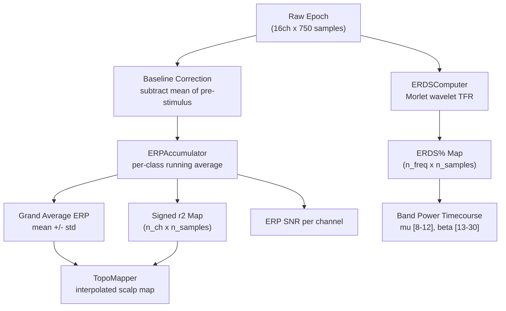

# Analysis Module

> [!info] Purpose
> Provides real-time and offline analysis tools for motor imagery EEG: ERP averaging with signed-r2 discriminability, time-frequency ERDS% maps via Morlet wavelets, and scalp topographic visualization.

## Files

- `src/analysis/erp.py` -- [[ERPAccumulator]] (running ERP averages, signed-r2)
- `src/analysis/time_frequency.py` -- [[ERDSComputer]] (Morlet wavelet ERDS%)
- `src/analysis/topography.py` -- `TopoMapper` (scalp interpolation and plotting)

## ERP Analysis Pipeline



## ERPAccumulator

Maintains per-class epoch buffers and computes:

| Method | Output | Purpose |
|--------|--------|---------|
| `get_erp(class_name)` | `(mean, std)` each `(n_ch, n_samples)` | Baseline-corrected class average |
| `get_grand_average()` | `(mean, std)` | Average across all classes |
| `compute_signed_r2(A, B)` | `(n_ch, n_samples)` | WHERE and WHEN classes differ |
| `compute_erp_snr(class)` | `(n_ch,)` | Signal quality per channel |

## ERDSComputer

Uses complex Morlet wavelets to decompose epochs into time-frequency power, then normalizes against a pre-stimulus baseline:

```
ERDS% = ((power(t,f) - baseline_power(f)) / baseline_power(f)) * 100
```

- **Negative ERDS%** = ERD (desynchronization) -- power decrease during MI
- **Positive ERDS%** = ERS (synchronization) -- power rebound after MI

| Method | Output | Purpose |
|--------|--------|---------|
| `compute_tfr(epoch, ch)` | `(n_freq, n_samples)` | Raw power spectrogram |
| `compute_erds(epoch, ch)` | `(n_freq, n_samples)` | Baseline-normalized ERDS% |
| `compute_erds_average(epochs)` | `(mean, std)` | Multi-trial average ERDS% |
| `compute_band_power(epoch, ch, band)` | `(power, erds)` | Band-specific timecourse |

## TopoMapper

Generates 2D interpolated scalp maps from 16-channel data using inverse-distance weighting via `scipy.interpolate.griddata`. Supports:

- Head outline with nose and ear markers
- Electrode positions labeled with 10-20 names
- Diverging colormaps (`RdBu_r`) for ERDS% visualization

## Related Pages

- [[ERPAccumulator]] -- Full class reference
- [[ERDSComputer]] -- Full class reference
- [[erp_trainer]] -- Script that uses all three analysis tools
- [[ERP Analysis Pipeline]] -- Detailed flow diagram
- [[Channel Layout]] -- 10-20 electrode positions used by TopoMapper
- [[Research Papers]] -- Pfurtscheller (1999), Luck (2014), Blankertz (2011)
