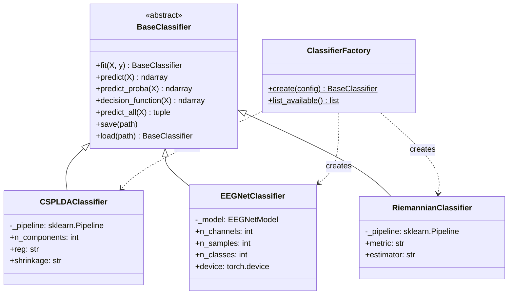

# Classification Module

> [!info] Purpose
> Provides three interchangeable classifiers for motor imagery EEG behind a common `BaseClassifier` interface. The [[ClassifierFactory]] reads `settings.yaml` and returns the configured classifier, ready for `fit()`.

## Files

- `src/classification/base.py` -- `BaseClassifier` abstract base class
- `src/classification/csp_lda.py` -- [[CSPLDAClassifier]]
- `src/classification/eegnet.py` -- [[EEGNetClassifier]]
- `src/classification/pipeline.py` -- `RiemannianClassifier`, `ClassifierFactory`

## Class Hierarchy

## Classifier Comparison

| Property | CSP+LDA | EEGNet | Riemannian MDM |
|----------|---------|--------|----------------|
| Model type | `csp_lda` | `eegnet` | `riemannian` |
| Approach | Spatial filter + linear | Deep CNN end-to-end | Geodesic on SPD manifold |
| Training data needed | 40 trials/class | 100+ trials/class | 40 trials/class |
| Training time | Seconds | Minutes (GPU) | Seconds |
| Robustness to non-stationarity | Low | Medium | High |
| Continuous output | `decision_function` (signed distance) | Raw logits | Negative geodesic distances |
| Save format | joblib `.pkl` | PyTorch `.pt` checkpoint | joblib `.pkl` |
| Dependencies | MNE, sklearn | PyTorch | pyRiemann, sklearn |

## Decision Output for Cursor Control

All three classifiers provide continuous output via `decision_function()` that maps to cursor velocity through [[ControlMapper]]:

- **CSP+LDA**: Signed distance to LDA hyperplane (scalar for 2-class, per-class for multi)
- **EEGNet**: Raw logits before softmax (per-class scores)
- **Riemannian MDM**: Negative geodesic distances to class means

## Related Pages

- [[Features]] -- Provides input features (CSP uses them internally)
- [[Control]] -- Consumes classification output
- [[CSPLDAClassifier]] -- Detailed class reference
- [[EEGNetClassifier]] -- Detailed class reference
- [[ControlMapper]] -- Maps decision scores to velocity
- [[train_model]] -- Script that invokes ClassifierFactory and ModelTrainer
- [[Configuration]] -- Classification config keys
- [[Research Papers]] -- References for each algorithm
