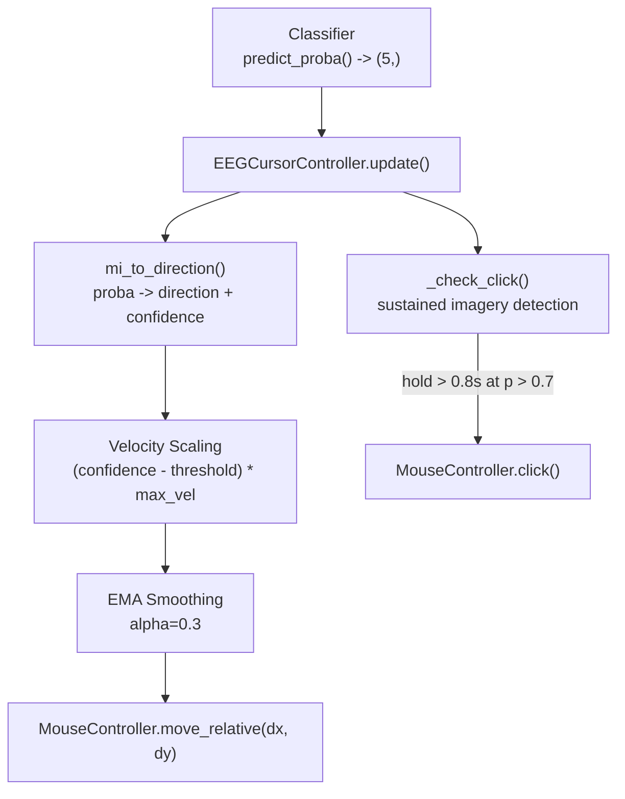
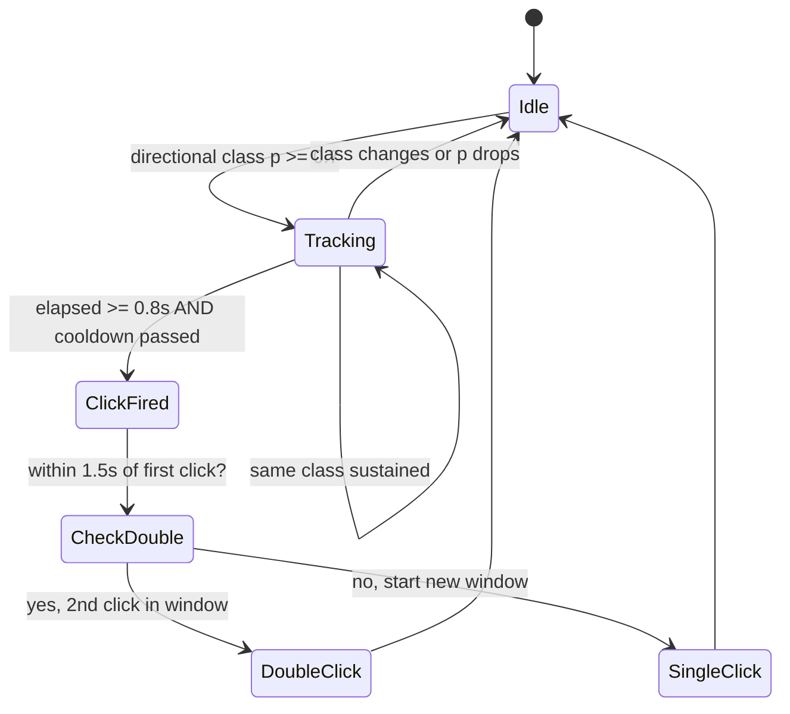

# Control Module

> [!info] Purpose
> Translates classifier output into physical cursor movement and click actions. Three layers: `MouseController` (low-level pyautogui), `ControlMapper` (signal processing), and `EEGCursorController` (state machine orchestrator).

## Files

- `src/control/mouse.py` -- `MouseController` (pyautogui wrapper)
- `src/control/mapping.py` -- [[ControlMapper]] (normalize, smooth, velocity map)
- `src/control/cursor_control.py` -- [[EEGCursorController]] (state machine)

## Control Stack

## Click Detection State Machine

## Direction Mapping

| MI Class | Direction | Velocity Axis |
|----------|-----------|---------------|
| `left_hand` | Left | dx = -speed |
| `right_hand` | Right | dx = +speed |
| `feet` | Down | dy = +speed |
| `tongue` | Up | dy = -speed |
| `rest` | None | dx=0, dy=0 |

## ControlMapper Processing Pipeline

1. **Normalize** (Welford's online algorithm) -- z-score with running mean/variance, clip to [-1, 1]
2. **Smooth** (EMA) -- `result = (1-alpha)*prev + alpha*value`
3. **Velocity Map** -- Dead zone (0.15) + linear scaling to `max_velocity` (25 px/frame)

## Key Parameters

| Parameter | Default | Config Key | Effect |
|-----------|---------|------------|--------|
| Dead zone | 0.15 | `control.dead_zone` | Minimum signal to register as movement |
| Max velocity | 25 px/frame | `control.max_velocity` | At 16 Hz = 400 px/sec max |
| Smoothing alpha | 0.3 | `control.smoothing_alpha` | Lower = smoother, slower response |
| Confidence threshold | 0.5 | `control.confidence_threshold` | Min probability for movement |
| Click hold duration | 0.8s | `control.click.hold_duration_s` | Time of sustained imagery for click |
| Click confidence | 0.7 | `control.click.confidence_threshold` | Higher bar for click vs movement |
| Click cooldown | 0.5s | `control.click.cooldown_s` | Min time between successive clicks |

## Related Pages

- [[Classification]] -- Provides probabilities and decision scores
- [[EEGCursorController]] -- Full class reference
- [[ControlMapper]] -- Full class reference
- [[Real-Time Control Loop]] -- Sequence diagram including control
- [[Configuration]] -- All control config keys
- [[Limitations]] -- Click auto-repeat, sub-pixel truncation, no diagonal movement
