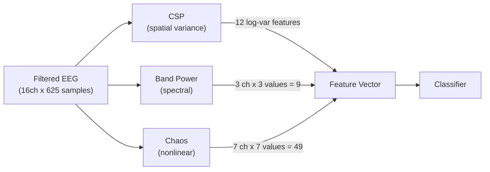

# Features Module

> [!info] Purpose
> Extracts discriminative features from preprocessed EEG epochs. Three parallel paths target different aspects of the motor imagery signal: spatial variance (CSP), spectral power (bandpower), and nonlinear dynamics (chaos).

## Files

- `src/features/csp.py` -- Common Spatial Patterns (CSPExtractor)
- `src/features/bandpower.py` -- Welch PSD band power (BandPowerExtractor)
- `src/features/chaos.py` -- Entropy and fractal features (ChaosFeatureExtractor)

## Three Parallel Feature Paths

> [!warning] Current Status
> Only **CSP features** are actually used by the [[CSPLDAClassifier]] pipeline. Band power and chaos features are implemented and tested but not wired into any classification pipeline. [[EEGNetClassifier]] learns features end-to-end. [[RiemannianClassifier]] uses covariance matrices directly. See [[Limitations]].

## CSP (Common Spatial Patterns)

| Property | Value |
|----------|-------|
| Class | `CSPExtractor` |
| Wraps | MNE `CSP` |
| Components | 12 (6 pairs) |
| Regularization | Ledoit-Wolf |
| Output | Log-variance features, shape `(n_trials, 12)` |
| Reference | Blankertz et al. (2008) |

CSP learns spatial filters that maximize the variance ratio between two classes. The first 6 filters maximize variance for class 1, the last 6 for class 2. The log-variance of each filtered signal becomes a feature.

## Band Power (Welch PSD)

| Property | Value |
|----------|-------|
| Class | `BandPowerExtractor` |
| Method | Welch's periodogram (Hann window, 50% overlap) |
| Bands | mu [8-12 Hz], beta [13-30 Hz] |
| Output per channel | mu_power, beta_power, beta/mu ratio |
| Integration | Simpson's rule |
| Reference | Pfurtscheller & Lopes da Silva (1999) |

## Chaos / Nonlinear Features

| Property | Value |
|----------|-------|
| Class | `ChaosFeatureExtractor` |
| Library | antropy |
| Features | hjorth (2), perm_entropy, spectral_entropy, higuchi_fd, sample_entropy |
| Output per channel | 7 values |
| Channels | Motor cortex (C3, C4, Cz, FC3, FC4, CP3, CP4) |
| Reference | Lotte et al. (2018) |

## Related Pages

- [[Preprocessing]] -- Provides filtered epochs
- [[Classification]] -- Consumes feature vectors
- [[CSPLDAClassifier]] -- Uses CSP features internally
- [[Configuration]] -- Feature extraction config keys
- [[Research Papers]] -- References for CSP, band power, chaos features
