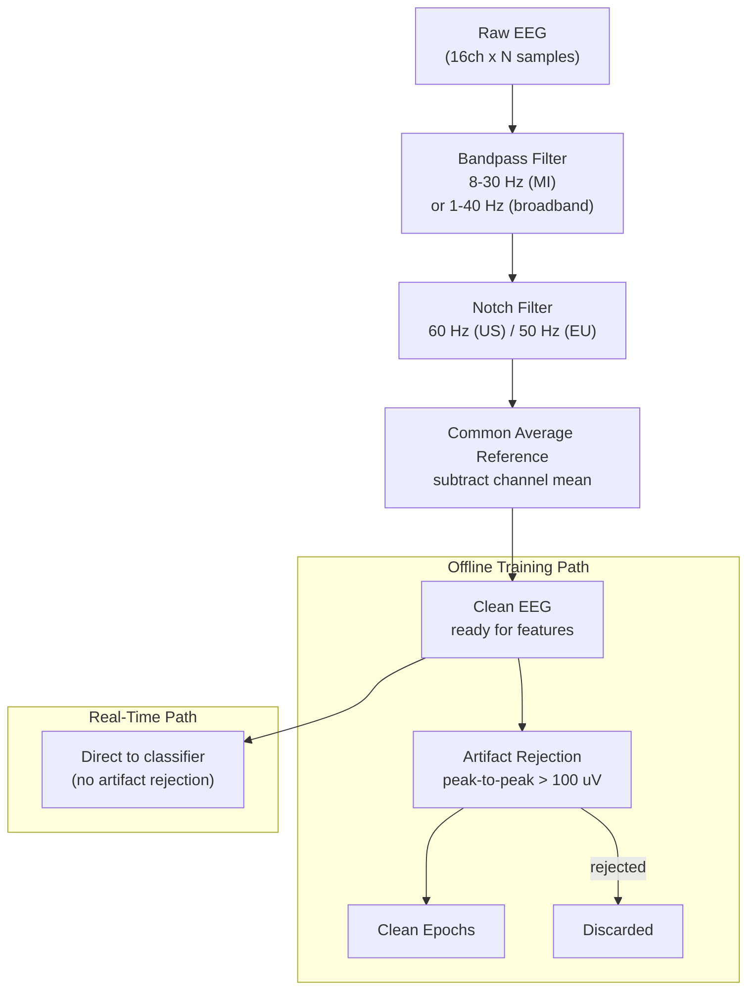

# Preprocessing Module

> [!info] Purpose
> Provides bandpass, notch, and spatial reference filters for both offline (zero-phase) and real-time (causal) modes. Includes artifact detection and epoch rejection for training data quality control.

## Files

- `src/preprocessing/filters.py` -- Temporal and spatial filters, `CausalFilterState`
- `src/preprocessing/artifacts.py` -- Epoch rejection, bad channel detection

## Filter Chain



## Functions

### Temporal Filters

| Function | Parameters | Mode | Notes |
|----------|-----------|------|-------|
| `bandpass_filter()` | data, sf, low, high, order=4, causal=False | Zero-phase (offline) or causal (real-time) | Butterworth SOS, `sosfiltfilt` or `sosfilt` |
| `notch_filter()` | data, sf, freq, quality=30, causal=False | Zero-phase or causal | IIR notch, removes line noise |

### Spatial Filters

| Function | Parameters | Notes |
|----------|-----------|-------|
| `common_average_reference()` | data (n_ch, n_samples) | Subtracts mean across channels at each timepoint |
| `laplacian_reference()` | data, channel_idx, neighbor_indices | Surface Laplacian for focal enhancement (not used in pipeline) |

### Artifact Handling

| Function | Parameters | Notes |
|----------|-----------|-------|
| `reject_epochs()` | epochs, labels, threshold_uv=100 | Peak-to-peak rejection; returns clean epochs + rejected indices |
| `detect_bad_channels()` | data, threshold_std=3.0 | Flags noisy or flatline channels by std outlier detection |

## CausalFilterState Class

Maintains SOS filter state across streaming chunks for real-time use:

```python
filt = CausalFilterState(sf=250, low=8.0, high=30.0)
while streaming:
    chunk = board.get_data()
    filtered = filt.apply(chunk)  # No transients at chunk boundaries
```

## Edge Case Guards

> [!warning] Robustness
> Every filter function guards against: empty input, single-sample input, NaN/Inf values, and data too short for zero-phase filtering (falls back to causal mode).

## Related Pages

- [[Acquisition]] -- Provides raw data to this module
- [[Features]] -- Consumes filtered data
- [[Signal Processing Chain]] -- Detailed frequency response information
- [[Configuration]] -- Preprocessing config keys
- [[Training]] -- [[ModelTrainer]] applies these filters during `prepare_data()`
