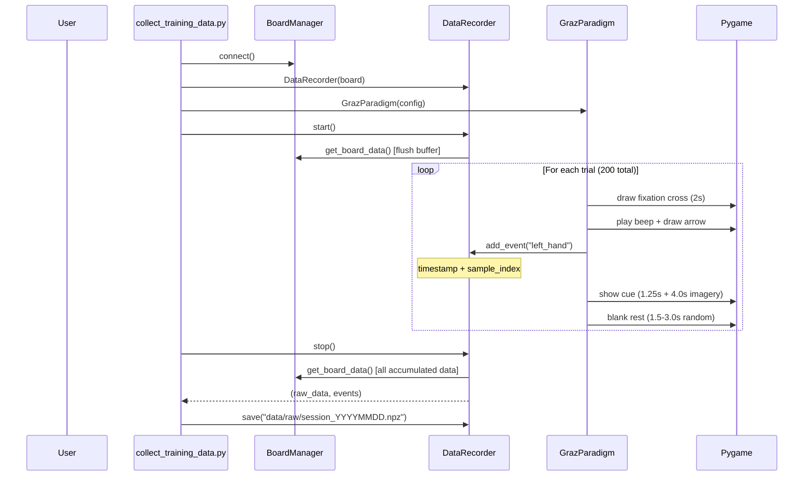
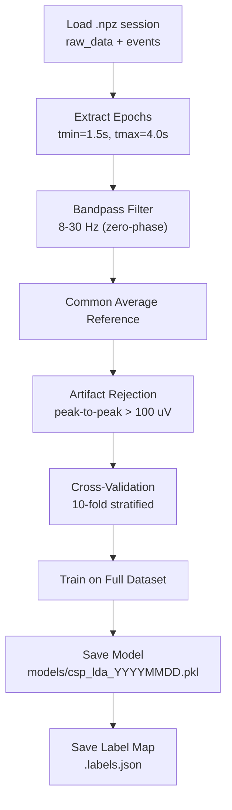

# Training Module

> [!info] Purpose
> Handles the full offline training pipeline: visual cue presentation (Graz paradigm), EEG data recording with event markers, epoch extraction, preprocessing, artifact rejection, classifier fitting, and cross-validated evaluation.

## Files

- `src/training/paradigm.py` -- `GrazParadigm` (visual cueing protocol)
- `src/training/recorder.py` -- `DataRecorder` (EEG + event recording)
- `src/training/trainer.py` -- `ModelTrainer` (preprocessing + fitting + evaluation)

## Calibration Sequence Diagram

## Training Pipeline (train_model.py)

## GrazParadigm Trial Structure

| Phase | Duration | Visual | Audio |
|-------|----------|--------|-------|
| Fixation | 2.0s | White `+` on black | None |
| Cue onset | instant | Arrow appears | 1000 Hz beep (70ms) |
| Cue + imagery | 5.25s (1.25 + 4.0) | Arrow sustained | None |
| Rest | 1.5-3.0s (random) | Blank screen | None |

- Trials are pseudo-randomized in blocks (each class appears once per block, shuffled)
- 40 trials/class x 5 classes = 200 total trials
- 2 runs with break screen between them
- ESC aborts at any time

## ModelTrainer Pipeline

1. `prepare_data()` -- epochs -> bandpass -> CAR -> artifact rejection
2. `train()` -- fits classifier, returns training accuracy
3. `cross_validate()` -- stratified K-fold, reports mean/std accuracy and chance level
4. `evaluate()` -- accuracy, confusion matrix, classification report, Cohen's kappa

## Related Pages

- [[Acquisition]] -- [[BoardManager]] provides data to [[DataRecorder]]
- [[Preprocessing]] -- Filters applied during `prepare_data()`
- [[Classification]] -- [[ClassifierFactory]] creates the classifier for training
- [[collect_training_data]] -- Script that runs the full calibration
- [[train_model]] -- Script that runs the training pipeline
- [[erp_trainer]] -- Alternative with real-time ERP feedback
- [[Training Pipeline]] -- Detailed flow diagram
- [[Configuration]] -- Training config keys
