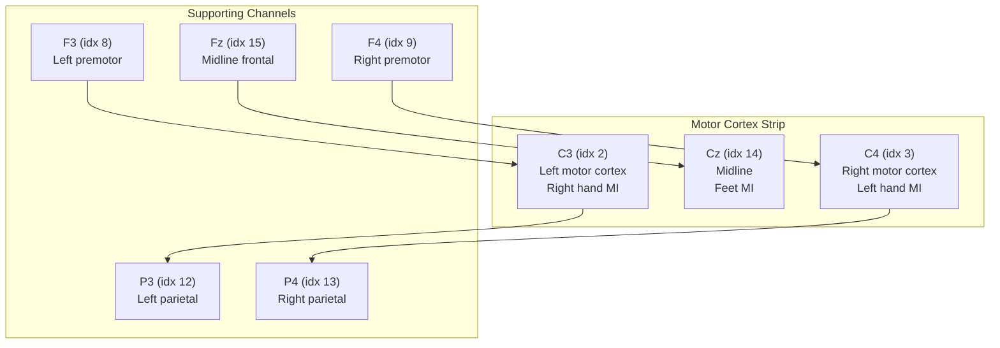

# Channel Layout

> [!info] 16-Channel 10-20 Montage
> The OpenBCI Cyton+Daisy uses a 16-channel layout covering the standard international 10-20 system positions. Defined in `src/analysis/topography.py`.

## Channel Map

| Index | Name | Region | 2D Position (x, y) |
|-------|------|--------|---------------------|
| 0 | Fp1 | Frontal pole (left) | (-0.31, 0.95) |
| 1 | Fp2 | Frontal pole (right) | (0.31, 0.95) |
| 2 | **C3** | **Central (left)** | **(-0.42, 0.00)** |
| 3 | **C4** | **Central (right)** | **(0.42, 0.00)** |
| 4 | P7 | Parietal (left) | (-0.71, -0.48) |
| 5 | P8 | Parietal (right) | (0.71, -0.48) |
| 6 | O1 | Occipital (left) | (-0.31, -0.85) |
| 7 | O2 | Occipital (right) | (0.31, -0.85) |
| 8 | **F3** | Frontal (left) | (-0.42, 0.58) |
| 9 | **F4** | Frontal (right) | (0.42, 0.58) |
| 10 | T7 | Temporal (left) | (-0.87, 0.00) |
| 11 | T8 | Temporal (right) | (0.87, 0.00) |
| 12 | **P3** | Parietal (left) | (-0.42, -0.48) |
| 13 | **P4** | Parietal (right) | (0.42, -0.48) |
| 14 | **Cz** | **Central (midline)** | **(0.00, 0.00)** |
| 15 | **Fz** | Frontal (midline) | (0.00, 0.58) |

Bold = **most important for motor imagery**

## ASCII Scalp Map

```
            Nose
             ^
        Fp1     Fp2

      F3    Fz    F4

   T7  C3    Cz    C4  T8

      P3          P4
   P7                P8

        O1      O2

  Left              Right
```

## Motor Imagery Critical Channels



## Channel Roles in MI Classification

| MI Class | Primary Channel | Contralateral ERD | Ipsilateral ERS |
|----------|----------------|-------------------|-----------------|
| Right hand | **C3** | Mu decrease at C3 | Possible mu increase at C4 |
| Left hand | **C4** | Mu decrease at C4 | Possible mu increase at C3 |
| Feet | **Cz** | Mu decrease at Cz (midline) | Bilateral pattern |
| Tongue | **Fz/Cz** | Frontal-central activation | Less lateralized |
| Rest | None | No systematic ERD | Baseline state |

## Channels Used by Feature Extractors

| Extractor | Channels | Config Key |
|-----------|----------|------------|
| CSP | All 16 (spatial filters learn which matter) | -- |
| Band Power | C3(0), C4(1), Cz(2) | `features.bandpower_channels` |
| Chaos | C3(0), C4(1), Cz(2), FC3(3), FC4(4), CP3(5), CP4(6) | `features.chaos_channels` |
| ERP Display | C3(2), C4(3), Cz(14) | `motor_channels` in ERPDisplay |

> [!warning] Index Mismatch
> The `bandpower_channels` and `chaos_channels` in `settings.yaml` use indices [0,1,2] which correspond to Fp1, Fp2, C3 in the BrainFlow channel list -- NOT C3, C4, Cz. This is because the config refers to positions within the **EEG channel array** returned by `BoardShim.get_eeg_channels()`, not absolute board channel indices. The actual mapping depends on the board type.

## TopoMapper Coordinate System

- Origin: vertex (Cz) at (0, 0)
- Nose pointing up (+y)
- Left ear at (-1, 0), right ear at (+1, 0)
- Head radius: 1.0 (unit circle)
- Interpolation grid: 64x64 pixels with cubic griddata

## Related Pages

- [[Analysis]] -- TopoMapper and ERPAccumulator use these positions
- [[Features]] -- Band power and chaos channel selections
- [[Preprocessing]] -- CAR operates across all 16 channels
- [[Configuration]] -- Channel-related config keys
- [[Limitations]] -- 16 channels vs 64+ in research systems
