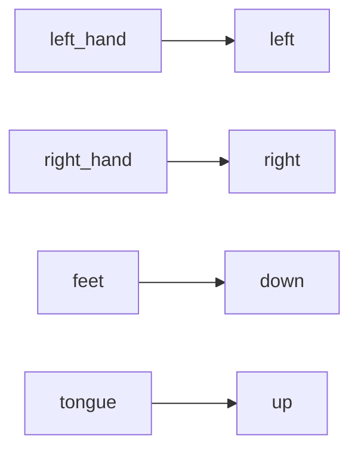

# Configuration Reference

> [!info] File Location
> `config/settings.yaml` -- loaded by `src/config.py` via `load_config()`

## Board Section

| Key | Default | Type | Read By | Description |
|-----|---------|------|---------|-------------|
| `board.board_id` | -1 | int | [[BoardManager]]`.__init__` | BrainFlow board ID (-1=synthetic, 0=Cyton, 2=Cyton+Daisy) |
| `board.serial_port` | `""` | str | [[BoardManager]]`.__init__` | COM port (e.g., COM3 or /dev/ttyUSB0) |
| `board.sampling_rate_override` | null | int/null | [[BoardManager]]`.get_sampling_rate` | Override auto-detected rate |
| `board.channel_count` | 16 | int | [[BoardManager]]`.__init__`, `ClassifierFactory` | Number of EEG channels |

## Preprocessing Section

| Key | Default | Type | Read By | Description |
|-----|---------|------|---------|-------------|
| `preprocessing.bandpass_low` | 1.0 | float | (broadband path) | Lower cutoff for broadband filter |
| `preprocessing.bandpass_high` | 40.0 | float | (broadband path) | Upper cutoff for broadband filter |
| `preprocessing.bandpass_order` | 4 | int | `ModelTrainer`, [[run_eeg_cursor]] | Butterworth filter order |
| `preprocessing.notch_freq` | 60.0 | float | (available, not applied) | Line noise frequency |
| `preprocessing.notch_quality` | 30.0 | float | (available, not applied) | Notch quality factor |
| `preprocessing.car_enabled` | true | bool | **DEAD** -- CAR always applied | Toggle CAR on/off |
| `preprocessing.laplacian_enabled` | false | bool | **DEAD** -- never applied | Toggle Laplacian reference |
| `preprocessing.mi_bandpass_low` | 8.0 | float | `ModelTrainer`, [[run_eeg_cursor]] | MI bandpass lower cutoff |
| `preprocessing.mi_bandpass_high` | 30.0 | float | `ModelTrainer`, [[run_eeg_cursor]] | MI bandpass upper cutoff |
| `preprocessing.artifact_threshold_uv` | 100.0 | float | `ModelTrainer` | Peak-to-peak rejection threshold |

## Features Section

| Key | Default | Type | Read By | Description |
|-----|---------|------|---------|-------------|
| `features.csp_n_components` | 12 | int | `ClassifierFactory` | CSP spatial filter count |
| `features.csp_regularization` | `"ledoit_wolf"` | str | `ClassifierFactory` | CSP covariance regularization |
| `features.chaos_enabled` | true | bool | **DEAD** -- never checked | Toggle chaos features |
| `features.chaos_features` | [list] | list | (test script only) | Which chaos features to compute |
| `features.chaos_channels` | [0-6] | list | (test script only) | Channels for chaos extraction |
| `features.bandpower_enabled` | true | bool | **DEAD** -- never checked | Toggle band power features |
| `features.bandpower_bands` | mu/beta | dict | (test script only) | Frequency band definitions |
| `features.bandpower_channels` | [0,1,2] | list | (test script only) | Channels for band power |

## Classification Section

| Key | Default | Type | Read By | Description |
|-----|---------|------|---------|-------------|
| `classification.model_type` | `"csp_lda"` | str | `ClassifierFactory.create` | Classifier type |
| `classification.lda_shrinkage` | `"auto"` | str | `ClassifierFactory._create_csp_lda` | LDA shrinkage |
| `classification.eegnet.F1` | 8 | int | `ClassifierFactory._create_eegnet` | Temporal filters |
| `classification.eegnet.D` | 2 | int | same | Depth multiplier |
| `classification.eegnet.F2` | 16 | int | same | Pointwise filters |
| `classification.eegnet.kernel_length` | 64 | int | same | Temporal kernel size |
| `classification.eegnet.dropout` | 0.5 | float | same | Dropout probability |
| `classification.eegnet.epochs` | 300 | int | same | Max training epochs |
| `classification.eegnet.batch_size` | 32 | int | same | Mini-batch size |
| `classification.eegnet.learning_rate` | 0.001 | float | same | Adam learning rate |
| `classification.eegnet.weight_decay` | 0.001 | float | same | Adam L2 penalty |
| `classification.eegnet.patience` | 50 | int | same | Early stopping patience |
| `classification.riemannian.metric` | `"riemann"` | str | `ClassifierFactory._create_riemannian` | Geodesic metric |
| `classification.riemannian.estimator` | `"oas"` | str | same | Covariance estimator |

## Control Section

| Key | Default | Type | Read By | Description |
|-----|---------|------|---------|-------------|
| `control.mode` | `"pure_eeg"` | str | **DEAD** -- hardcoded | Control mode |
| `control.dead_zone` | 0.15 | float | [[EEGCursorController]] | Min signal for movement |
| `control.max_velocity` | 25 | float | [[EEGCursorController]] | Max px/frame |
| `control.update_rate_hz` | 16 | int | [[run_eeg_cursor]] | Classifications per second |
| `control.smoothing_alpha` | 0.3 | float | [[EEGCursorController]] | EMA weight |
| `control.confidence_threshold` | 0.5 | float | [[EEGCursorController]] | Min probability for movement |
| `control.click.method` | `"sustained_mi"` | str | **DEAD** -- hardcoded | Click method |
| `control.click.hold_duration_s` | 0.8 | float | [[EEGCursorController]] | Sustained time for click |
| `control.click.confidence_threshold` | 0.7 | float | [[EEGCursorController]] | Click confidence bar |
| `control.click.double_click_window_s` | 1.5 | float | [[EEGCursorController]] | Double-click window |
| `control.click.cooldown_s` | 0.5 | float | [[EEGCursorController]] | Minimum between clicks |
| `control.direction_map` | (see below) | dict | [[EEGCursorController]] | Class -> direction |

## Training Section

| Key | Default | Type | Read By | Description |
|-----|---------|------|---------|-------------|
| `training.paradigm` | `"graz"` | str | **DEAD** -- hardcoded | Paradigm type |
| `training.n_classes` | 5 | int | `GrazParadigm`, `ModelTrainer`, `ClassifierFactory` | Number of MI classes |
| `training.classes` | [5 names] | list | `GrazParadigm`, [[run_eeg_cursor]] | Class name list |
| `training.n_trials_per_class` | 40 | int | `GrazParadigm` | Trials per class |
| `training.n_runs` | 2 | int | `GrazParadigm` | Runs with breaks |
| `training.fixation_duration` | 2.0 | float | `GrazParadigm` | Fixation cross duration |
| `training.cue_duration` | 1.25 | float | `GrazParadigm` | Cue visibility before imagery |
| `training.imagery_duration` | 4.0 | float | `GrazParadigm` | Imagery period |
| `training.rest_duration_min` | 1.5 | float | `GrazParadigm` | Min rest between trials |
| `training.rest_duration_max` | 3.0 | float | `GrazParadigm` | Max rest between trials |
| `training.classification_window_start` | 1.5 | float | `ModelTrainer`, [[run_eeg_cursor]] | Epoch start (s post-cue) |
| `training.classification_window_end` | 4.0 | float | `ModelTrainer`, [[run_eeg_cursor]] | Epoch end (s post-cue) |
| `training.beep_frequency` | 1000 | int | `GrazParadigm` | Beep tone Hz |
| `training.beep_duration_ms` | 70 | int | `GrazParadigm` | Beep duration ms |

## UI Section (ALL DEAD)

| Key | Default | Status |
|-----|---------|--------|
| `ui.signal_window_s` | 4 | Not read by any code |
| `ui.plot_update_ms` | 50 | Not read by any code |
| `ui.show_fft` | true | Not read by any code |
| `ui.show_classifier_output` | true | Not read by any code |
| `ui.feedback_type` | `"bar"` | Not read by any code |

## Paths Section

| Key | Default | Read By |
|-----|---------|---------|
| `paths.data_dir` | `"data"` | -- |
| `paths.models_dir` | `"models"` | [[train_model]] |
| `paths.raw_data_dir` | `"data/raw"` | [[collect_training_data]] |
| `paths.processed_data_dir` | `"data/processed"` | -- |

## Related Pages

- [[Architecture]] -- How config flows through the system
- [[Limitations]] -- Dead configuration keys documented
- [[run_eeg_cursor]] -- Primary runtime consumer of config
- [[train_model]] -- Training consumer of config
