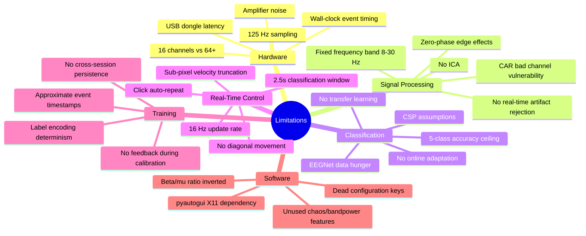

# Limitations

> [!info] Source
> Full documentation: `LIMITATIONS.md` in the project root. This page summarizes the key limitations and links to relevant vault pages.

## Limitation Categories

## Hardware Limitations

| Limitation | Impact | Mitigation |
|-----------|--------|-----------|
| 16 channels | Lower spatial resolution, fewer CSP components | Standard 10-20 positions sufficient for 4-direction MI |
| 125 Hz (Cyton+Daisy) | No high-gamma, adequate for mu/beta | Primary MI signals well within Nyquist |
| Wall-clock event timing | 1-10ms jitter | Negligible for MI (signals evolve over hundreds of ms) |
| ~80-200ms end-to-end latency | Thought-to-action delay | Fundamental MI-BCI limitation |

## Classification Accuracy Expectations

| Level | Accuracy | Description |
|-------|----------|-------------|
| Chance | 20% | Random guessing (5 classes) |
| Untrained subject | 25-35% | Slightly above chance |
| After 2-3 sessions | 35-55% | Usable with patience |
| Skilled user (10+ sessions) | 50-70% | Comfortable control |
| Competition winners (22ch) | 60-80% | Optimized, per-subject |

> [!warning] Even 60% accuracy means 40% of commands are wrong. The cursor will frequently move in unintended directions.

## Dead Configuration Keys

Keys in `settings.yaml` that exist but have no effect:

| Key | Intended Purpose |
|-----|-----------------|
| `control.mode` | Hardcoded to pure_eeg |
| `control.click.method` | Hardcoded to sustained_mi |
| `training.paradigm` | Hardcoded to Graz |
| `preprocessing.car_enabled` | CAR always applied |
| `preprocessing.laplacian_enabled` | Never applied |
| `features.chaos_enabled` | Never checked |
| `features.bandpower_enabled` | Never checked |
| All `ui.*` keys | GUI does not read them |

See [[Configuration]] for the complete key reference.

## Unused Feature Extractors

The chaos and bandpower feature extractors are implemented and tested but NOT wired into any classification pipeline:
- [[CSPLDAClassifier]] uses only CSP log-variance features
- [[EEGNetClassifier]] learns features end-to-end
- Riemannian MDM uses covariance matrices directly

See [[Features]] for details.

## What This System Cannot Do

| Capability | Status |
|-----------|--------|
| Read thoughts | No -- EEG measures bulk electrical activity |
| Sub-second precision | No -- MI signals evolve over 1-3 seconds |
| Work without calibration | No -- each brain is unique |
| Replace a mouse for daily use | No -- too slow and inaccurate |
| Classify more than 5 states | Theoretical limit |
| Achieve > 90% accuracy | Extremely unlikely with non-invasive EEG |

## Comparison to Research-Grade Systems

| Feature | This System | Competition Winners | Clinical BCI |
|---------|-------------|--------------------| -------------|
| Channels | 16 | 22-64 | 16-256 |
| Sampling rate | 125 Hz | 250-1000 Hz | 256-2400 Hz |
| Event timing | Wall clock (~10ms) | Hardware TTL (~1ms) | Hardware TTL |
| Artifact rejection | Offline only | Real-time ICA | Real-time adaptive |
| Typical 4-class accuracy | 35-60% | 65-80% | 70-85% |
| Cost | ~$1,000 | $10,000-50,000 | $20,000-100,000 |

## Related Pages

- [[Architecture]] -- System design context
- [[Configuration]] -- All config keys including dead ones
- [[Control]] -- Click auto-repeat, sub-pixel issues
- [[Signal Processing Chain]] -- Filter edge effects, CAR assumptions
- [[Classification]] -- Accuracy ceilings, classifier comparison
- [[Training]] -- Calibration requirements
- [[Channel Layout]] -- 16-channel spatial resolution
- [[Research Papers]] -- Competition results and baseline comparisons
