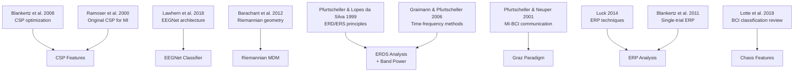

# Research Papers

> [!info] Overview
> All papers cited in the OpenBCI SimpleBuild codebase, organized by which module or technique they support.

## Paper Index

---

## 1. Blankertz et al. (2008) -- CSP Optimization

> Blankertz, B., Tomioka, R., Lemm, S., Kawanabe, M., & Muller, K.-R. (2008). **Optimizing Spatial Filters for Robust EEG Single-Trial Analysis.** *IEEE Signal Processing Magazine*, 25(1), 41-56.

| Cited In | Contribution |
|----------|-------------|
| `src/features/csp.py` | Theoretical basis for CSP spatial filter design |
| `src/classification/csp_lda.py` | Regularized CSP with Ledoit-Wolf shrinkage |

**Key ideas**: CSP maximizes variance ratio between classes. Regularization (Ledoit-Wolf) prevents overfitting with small training sets. Log-variance features improve Gaussianity for LDA.

## 2. Ramoser et al. (2000) -- Original CSP for Motor Imagery

> Ramoser, H., Muller-Gerking, J., & Pfurtscheller, G. (2000). **Optimal Spatial Filtering of Single Trial EEG During Imagined Hand Movement.** *IEEE Trans. Rehab. Eng.*, 8(4), 441-446.

| Cited In | Contribution |
|----------|-------------|
| `src/classification/csp_lda.py` | Foundational CSP algorithm for left/right hand MI |

**Key ideas**: First application of CSP to motor imagery BCI. Spatial filters extract lateralized mu/beta patterns for left vs right hand classification.

## 3. Lawhern et al. (2018) -- EEGNet

> Lawhern, V. J., Solon, A. J., Waytowich, N. R., Gordon, S. M., Hung, C. P., & Lance, B. J. (2018). **EEGNet: a compact convolutional neural network for EEG-based brain-computer interfaces.** *Journal of Neural Engineering*, 15(5), 056013.

| Cited In | Contribution |
|----------|-------------|
| `src/classification/eegnet.py` | Complete architecture specification (Table 2) |

**Key ideas**: Depthwise convolutions learn spatial filters analogous to CSP. Separable convolutions reduce parameters. Max-norm constraint on depthwise weights. Works across multiple BCI paradigms (MI, P300, SSVEP).

## 4. Barachant et al. (2012) -- Riemannian Geometry BCI

> Barachant, A., Bonnet, S., Congedo, M., & Jutten, C. (2012). **Multiclass brain-computer interface classification by Riemannian geometry.** *IEEE Trans. Biomed. Eng.*, 59(4), 920-928.

| Cited In | Contribution |
|----------|-------------|
| `src/classification/pipeline.py` | MDM classifier on SPD manifold via pyRiemann |

**Key ideas**: EEG covariance matrices live on the SPD manifold. Minimum Distance to Mean (MDM) classifies by geodesic distance to class centroids. Naturally robust to non-stationarity.

## 5. Pfurtscheller & Lopes da Silva (1999) -- ERD/ERS

> Pfurtscheller, G. & Lopes da Silva, F. H. (1999). **Event-related EEG/MEG synchronization and desynchronization: basic principles.** *Clinical Neurophysiology*, 110(11), 1842-1857.

| Cited In | Contribution |
|----------|-------------|
| `src/features/bandpower.py` | ERD/ERS theory for mu (8-12 Hz) and beta (13-30 Hz) |
| `src/analysis/time_frequency.py` | ERDS% formula and baseline normalization |

**Key ideas**: Motor imagery produces mu ERD (power decrease) over contralateral motor cortex. Post-imagery beta ERS (rebound) follows. These are the primary signals for MI-BCI.

## 6. Pfurtscheller & Neuper (2001) -- MI-BCI Communication

> Pfurtscheller, G. & Neuper, C. (2001). **Motor imagery and direct brain-computer communication.** *Proceedings of the IEEE*, 89(7), 1123-1134.

| Cited In | Contribution |
|----------|-------------|
| `src/training/paradigm.py` | Graz motor imagery paradigm design (cue, timing, feedback) |

**Key ideas**: Visual cue protocol for MI calibration. Fixation cross -> beep -> arrow cue -> imagery -> rest. Pseudo-randomized trial order. Used worldwide as the standard MI-BCI paradigm.

## 7. Luck (2014) -- ERP Technique

> Luck, S. J. (2014). **An Introduction to the Event-Related Potential Technique.** MIT Press.

| Cited In | Contribution |
|----------|-------------|
| `src/analysis/erp.py` | ERP averaging, baseline correction, SNR computation |

**Key ideas**: Trial averaging reduces noise. Baseline correction (pre-stimulus subtraction). Signal-to-noise improves as sqrt(N) with trial count.

## 8. Blankertz et al. (2011) -- Single-Trial ERP

> Blankertz, B., Lemm, S., Treder, M., Haufe, S., & Muller, K.-R. (2011). **Single-trial analysis and classification of ERP components.** *NeuroImage*, 56(2), 814-825.

| Cited In | Contribution |
|----------|-------------|
| `src/analysis/erp.py` | Signed-r2 discriminability measure |

**Key ideas**: Signed r2 = sign(mean_A - mean_B) * r2 shows where and when two conditions differ. Useful for feature selection and understanding what the classifier is using.

## 9. Lotte et al. (2018) -- BCI Classification Review

> Lotte, F., et al. (2018). **A review of classification algorithms for EEG-based brain-computer interfaces: a 10 year update.** *Journal of Neural Engineering*.

| Cited In | Contribution |
|----------|-------------|
| `src/features/chaos.py` | Rationale for nonlinear/entropy features in BCI |

**Key ideas**: Comprehensive review of BCI classification methods. Nonlinear features (entropy, fractal dimension) capture neural dynamics complementary to spectral features.

## 10. Graimann & Pfurtscheller (2006) -- Time-Frequency Methods

> Graimann, B. & Pfurtscheller, G. (2006). **Quantification and visualization of event-related changes in oscillatory brain activity in the time-frequency domain.** *Progress in Brain Research*.

| Cited In | Contribution |
|----------|-------------|
| `src/analysis/time_frequency.py` | Morlet wavelet TFR and ERDS% computation methods |

**Key ideas**: Complex Morlet wavelets provide time-frequency decomposition. ERDS% normalization against baseline reveals event-related power changes. n_cycles parameter trades time vs frequency resolution.

## Related Pages

- [[Features]] -- Uses CSP, bandpower, chaos papers
- [[Classification]] -- Uses CSP+LDA, EEGNet, Riemannian papers
- [[Analysis]] -- Uses ERD/ERS, ERP, time-frequency papers
- [[Training]] -- Uses Graz paradigm paper
