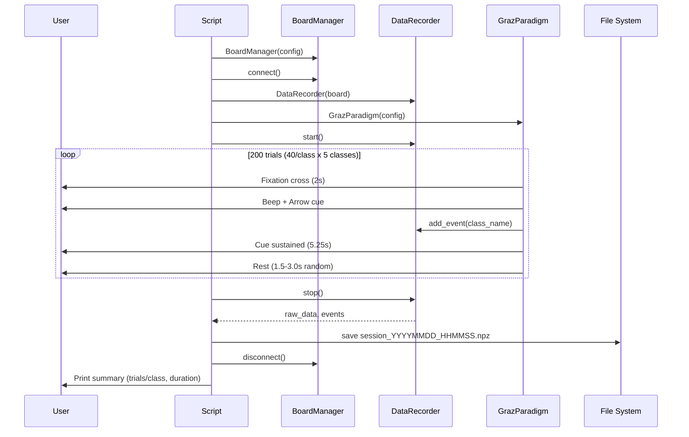

# collect_training_data.py

> [!info] File Location
> `scripts/collect_training_data.py`

## Purpose

Runs the Graz motor imagery calibration paradigm: presents visual cues (arrows) on a fullscreen pygame display, records time-locked event markers alongside continuous EEG, and saves everything to a timestamped `.npz` file for later model training with [[train_model]].

## Usage

```bash
python scripts/collect_training_data.py
python scripts/collect_training_data.py --config config/settings.yaml
python scripts/collect_training_data.py --output-dir data/raw --debug
```

## Calibration Flow



## Output File Format

The `.npz` archive contains:

| Key | Type | Shape | Description |
|-----|------|-------|-------------|
| `data` | `float64` | `(n_total_ch, n_samples)` | All BrainFlow channels |
| `events_json` | `str` | -- | JSON array of `{label, timestamp, sample_index}` |
| `sf` | `int` | scalar | Sampling frequency |
| `eeg_channels` | `int[]` | `(16,)` | EEG channel indices |

## Stages

1. Load config from `settings.yaml`
2. Create [[BoardManager]], connect to board (or synthetic fallback)
3. Create `DataRecorder` wrapping the board
4. Create `GrazParadigm` from training config
5. `recorder.start()` -- flush buffer, begin timestamping
6. `paradigm.run(recorder)` -- present all trials, record events
7. `recorder.stop()` -- retrieve all data
8. Save `.npz` with metadata
9. Print summary: duration, events per class, file path
10. Disconnect board

## Key Dependencies

| Component | Purpose |
|-----------|---------|
| [[BoardManager]] | EEG data source |
| `DataRecorder` | Event-marked recording |
| `GrazParadigm` | Visual cueing protocol (pygame) |
| `load_config` | Settings from YAML |

## Related Pages

- [[Training]] -- Module overview
- [[train_model]] -- Next step: train a model on the saved data
- [[erp_trainer]] -- Alternative with real-time ERP feedback
- [[Training Pipeline]] -- Full pipeline from collect to train
- [[Configuration]] -- Training config keys (classes, trials, timing)
