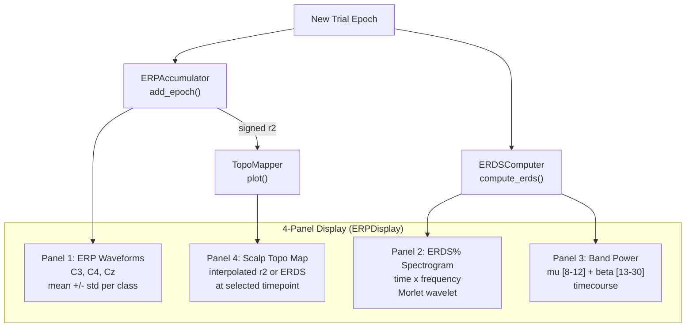
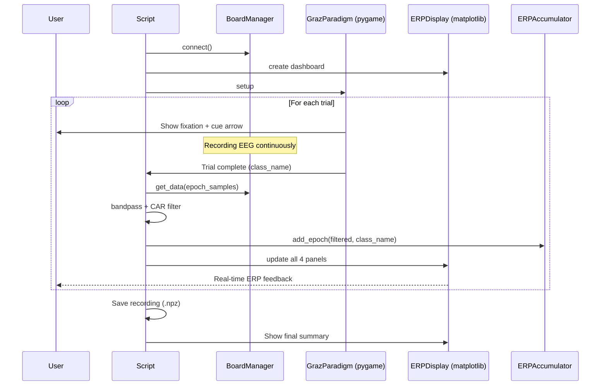

# erp_trainer.py

> [!info] File Location
> `scripts/erp_trainer.py`

## Purpose

Standalone tool for collecting motor imagery EEG data while providing real-time visual feedback of the subject's ERPs, ERDS% maps, and signal quality -- WITHOUT requiring model training. Helps subjects learn to produce consistent, detectable motor imagery signals.

## Two Modes

| Mode | Command | Purpose |
|------|---------|---------|
| **Collection** (default) | `python scripts/erp_trainer.py` | Run Graz paradigm + live ERP feedback |
| **Review** | `python scripts/erp_trainer.py --review data/raw/session.npz` | Offline analysis of a previous recording |

## ERP Display Dashboard



## Collection Mode Flow



## Analysis Components Used

| Component | Class | Purpose |
|-----------|-------|---------|
| [[ERPAccumulator]] | `src.analysis.erp` | Running ERP averages, signed-r2, SNR |
| [[ERDSComputer]] | `src.analysis.time_frequency` | ERDS% spectrograms, band power timecourses |
| `TopoMapper` | `src.analysis.topography` | Scalp topographic maps |
| `bandpass_filter` | `src.preprocessing.filters` | 1-40 Hz broadband filtering |
| `common_average_reference` | `src.preprocessing.filters` | Spatial filtering |

## Usage

```bash
# Live collection with real-time feedback
python scripts/erp_trainer.py

# Review a previous recording
python scripts/erp_trainer.py --review data/raw/session_20260326.npz

# Custom classes and trial count
python scripts/erp_trainer.py --classes left_hand right_hand --n-trials 30 --debug
```

## Related Pages

- [[Training]] -- Module overview
- [[Analysis]] -- ERP and ERDS analysis tools
- [[ERPAccumulator]] -- Running ERP computation
- [[ERDSComputer]] -- Time-frequency decomposition
- [[ERP Analysis Pipeline]] -- Detailed flow
- [[collect_training_data]] -- Simpler alternative without feedback
- [[Channel Layout]] -- Electrode positions for topo maps
