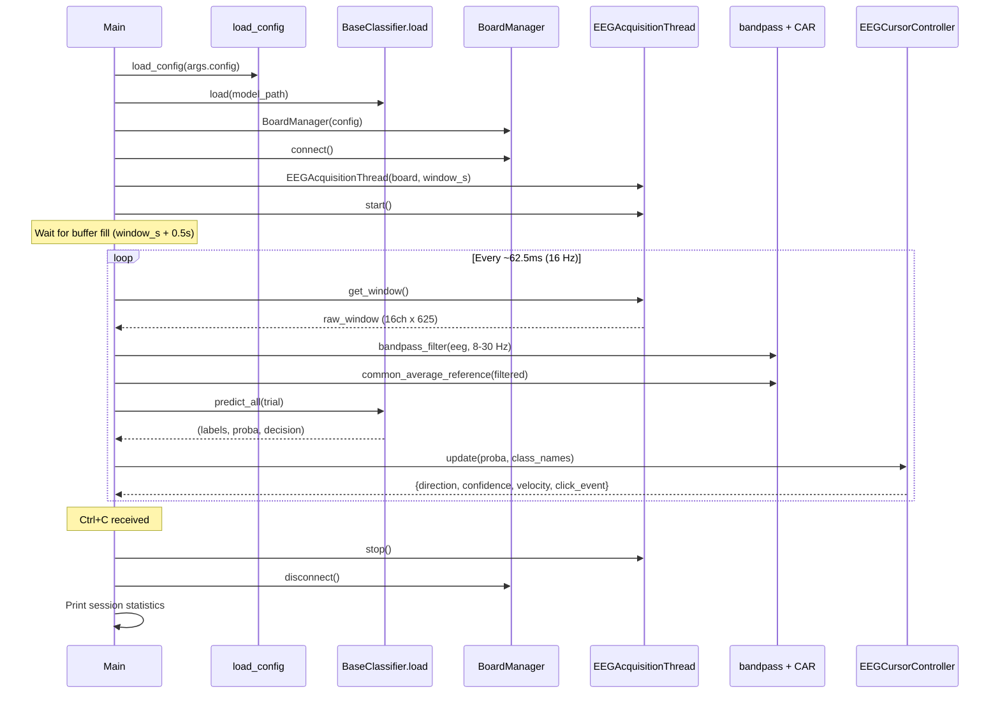

# run_eeg_cursor.py

> [!info] File Location
> `scripts/run_eeg_cursor.py`

## Purpose

The main real-time application. Connects to the EEG board, loads a trained classifier, and runs a 16 Hz control loop translating 5-class motor imagery into 4-directional cursor movement with click via sustained imagery.

## Usage

```bash
python scripts/run_eeg_cursor.py --model models/csp_lda_20260325.pkl
python scripts/run_eeg_cursor.py --model models/eegnet.pt --config config/settings.yaml --verbose
```

## Sequence Diagram



## Application Stages

1. **Thread budget** -- Reserves CPU cores; sets OMP/MKL/PyTorch thread limits
2. **Load config** -- `load_config()` from `config/settings.yaml`
3. **Load model** -- `BaseClassifier.load(path)`, loads `.labels.json` for class mapping
4. **Connect board** -- [[BoardManager]] with auto-synthetic fallback
5. **MI bandpass params** -- Reads `mi_bandpass_low/high` from config, clamps to Nyquist
6. **Create controller** -- [[EEGCursorController]] with velocity/click parameters
7. **Start acquisition thread** -- Background thread polls board every 20ms
8. **Main control loop** -- 16 Hz: acquire -> preprocess -> classify -> update cursor
9. **Shutdown** -- Stop acquisition thread, disconnect board, print stats

## EEGAcquisitionThread

Internal helper class that continuously reads EEG data on a background thread:

- Maintains a rolling buffer of the latest `window_samples` (default 625 for 2.5s at 250 Hz)
- Main loop reads `get_window()` without blocking
- Poll interval: 20ms

## Key Dependencies

| Component | Class/Function | Purpose |
|-----------|---------------|---------|
| [[BoardManager]] | `src.acquisition.board` | Hardware connection |
| [[EEGCursorController]] | `src.control.cursor_control` | Movement + click |
| `BaseClassifier.load` | `src.classification.base` | Model loading |
| `bandpass_filter` | `src.preprocessing.filters` | 8-30 Hz filtering |
| `common_average_reference` | `src.preprocessing.filters` | Spatial filtering |
| `load_config` | `src.config` | YAML config |

## Related Pages

- [[Real-Time Control Loop]] -- Detailed flow
- [[Architecture]] -- System overview
- [[Classification]] -- Model types that can be loaded
- [[Control]] -- Cursor control module details
- [[Configuration]] -- All config keys used
- [[Limitations]] -- Latency, update rate, accuracy constraints
