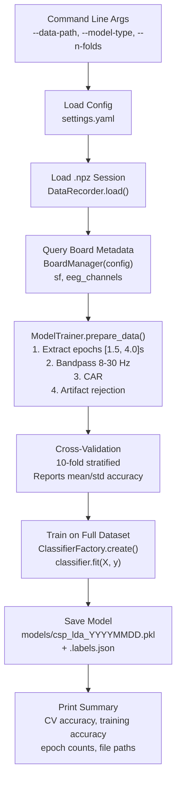

# train_model.py

> [!info] File Location
> `scripts/train_model.py`

## Purpose

Loads a recorded `.npz` session (from [[collect_training_data]] or [[erp_trainer]]), extracts and filters epochs, rejects artifacts, performs stratified cross-validation, trains on the full dataset, and saves the fitted model alongside its label mapping.

## Usage

```bash
python scripts/train_model.py --data-path data/raw/session_20260325.npz
python scripts/train_model.py --data-path data/raw/session.npz --model-type eegnet
python scripts/train_model.py --data-path data/raw/session.npz --n-folds 5 --verbose
```

## Training Flow



## Stages

1. **Parse args** -- data path, model type override, n-folds, output dir
2. **Load config** -- `settings.yaml`, optionally override `model_type`
3. **Load data** -- `DataRecorder.load(path)` returns `(raw_data, events, metadata)`
4. **Query metadata** -- Creates temporary [[BoardManager]] for sf and channel info
5. **Prepare data** -- `ModelTrainer.prepare_data()`:
   - Extract epochs using event markers (tmin=1.5s, tmax=4.0s)
   - Bandpass filter 8-30 Hz (zero-phase)
   - Common average reference
   - Artifact rejection (peak-to-peak > 100 uV)
6. **Create classifier** -- `ClassifierFactory.create(config)` returns configured unfitted classifier
7. **Cross-validate** -- Stratified K-fold, reports mean accuracy vs chance level
8. **Train** -- `ModelTrainer.train(classifier, X, y)` fits on all clean epochs
9. **Save** -- Model `.pkl` + label map `.labels.json`
10. **Summary** -- Print CV results, training accuracy, epoch distribution

## Output Files

| File | Format | Content |
|------|--------|---------|
| `models/csp_lda_YYYYMMDD_HHMMSS.pkl` | joblib pickle | Fitted classifier |
| `models/csp_lda_YYYYMMDD_HHMMSS.labels.json` | JSON | `{"left_hand": 0, "rest": 1, ...}` |

> [!warning] Label Map Required
> The `.labels.json` file MUST accompany the model. Without it, [[run_eeg_cursor]] cannot map predicted integer labels to class names. See [[Limitations]].

## Key Dependencies

| Component | Purpose |
|-----------|---------|
| `DataRecorder.load()` | Load recorded session |
| [[BoardManager]] | Query sf and channel layout |
| `ModelTrainer` | Epoch extraction, filtering, training, CV |
| `ClassifierFactory` | Create classifier from config |
| `BaseClassifier.save()` | Serialize trained model |

## Related Pages

- [[collect_training_data]] -- Previous step: record calibration data
- [[run_eeg_cursor]] -- Next step: use the trained model for cursor control
- [[Training Pipeline]] -- Full pipeline diagram
- [[Classification]] -- Available classifier types
- [[Configuration]] -- Classification and training config keys
